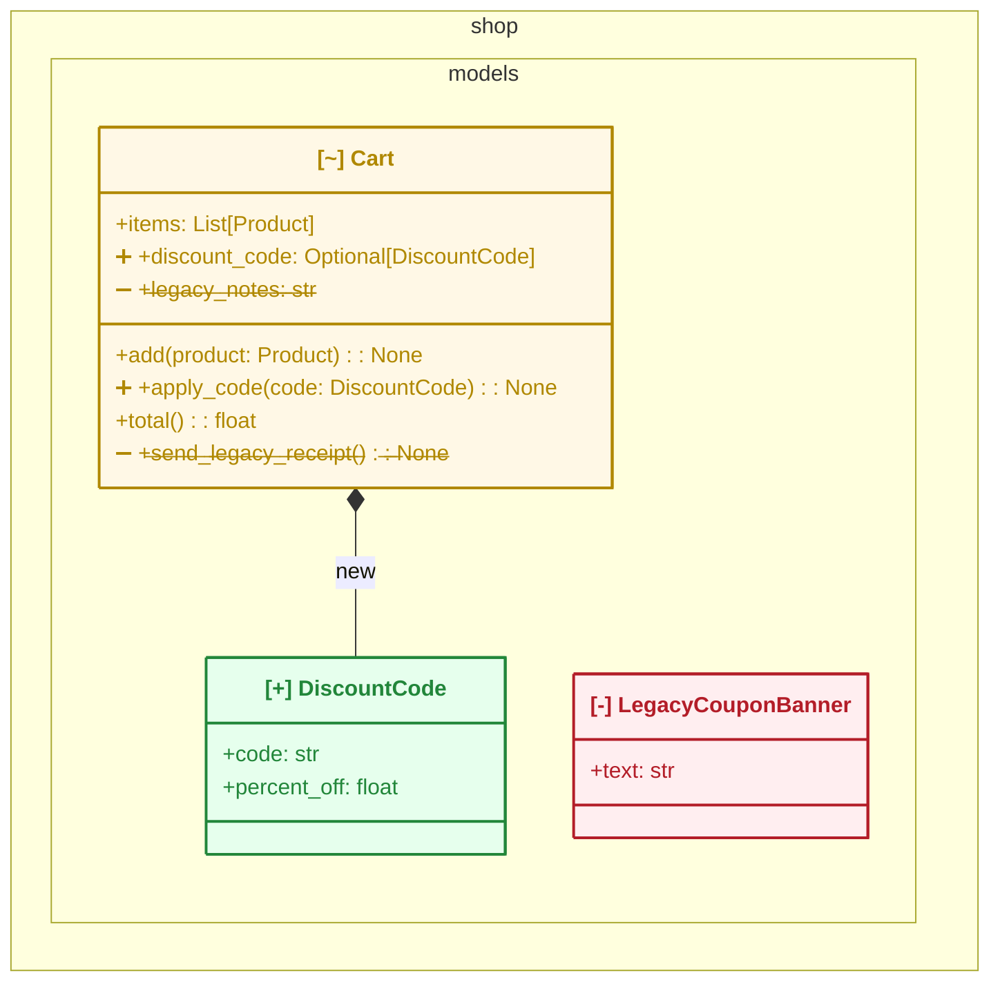

# design-diff

> **design-diff** compares two Python code snapshots (`base_ref`, `head_ref`) and
> outputs a class-level structure diff — added/removed/modified classes, inheritance,
> composition dependencies — as a Mermaid `classDiagram` and machine-readable JSON.
> Install: `uv add design-diff` (or `pip install design-diff`). Run:
> `design-diff diff <base_ref> <head_ref> --package <pkg> --format mermaid|json|svg`.
> Requires type annotations to detect dependencies (see Limitations below).
> Executes the analyzed code via import — only run against trusted (same-repo) code;
> see Security below.

AIがコードを書く時代、人間のレビューは行diffから設計diffへ上がる。「500行変わった」
ではなく「このクラスが増え、この依存が生えた」を**1枚の絵**で見せるのが design-diff
の価値。文字ベースのdiffではなく、**Mermaidのクラス図としてプレビューできること**が
このツールの中心的な価値であり、それ以外の全ての設計判断はこの1点に従属する。

出力例(実際にCLIを実行した結果、手を加えていない): [docs/examples/](./docs/examples/)

### 出力例(抜粋)

`design-diff diff main feature/discount-codes --package shop --format mermaid` の
実際の出力(手を加えていない。完全版は
[docs/examples/shop-discount-codes.md](./docs/examples/shop-discount-codes.md)):



`DiscountCode`クラスの追加(緑)、`LegacyCouponBanner`クラスの削除(赤)、`Cart`の
変更(黄)が、1枚の図に収まっている。`Cart`は追加プロパティ・追加メソッド・
削除プロパティ・削除メソッドの4種類全てを含む例になっている:
`discount_code`/`apply_code()`が新しく増えたメンバーは行頭の➕で、
`legacy_notes`/`send_legacy_receipt()`のように無くなったメンバーは行頭の➖と
取り消し線の両方で分かる。`Cart *-- DiscountCode`という新しいコンポジション
依存にも矢印ラベルで`: new`が付く。

## 使い方

```bash
uv add design-diff
design-diff diff main feature/my-branch --package myapp --format mermaid
```

`--format` は `mermaid`(既定) / `json` / `svg` を選べる。

## どこでプレビューするか(重要)

- **GitHubのPRコメント**: GitHubは ```` ```mermaid ```` フェンスで囲まれたコードブロックを
  ネイティブにクラス図としてレンダリングする。design-diffのGitHub Actionワークフロー
  (`.github/workflows/design-diff-comment.yml`)はこの形式でコメントを投稿するので、
  **追加の設定なしにPR上で絵として見える**。README上のMermaidブロックも同様に
  GitHub上でプレビューされる(このREADME自体、[docs/examples/](./docs/examples/)の
  ブロックがその実例)
- **ローカルCLI利用時**: ターミナルにMermaidのテキストが出るだけではプレビューできない。
  次の3つの方法がある:
  1. `--format svg` でSVGを直接出力する(下記参照。要 [mermaid-cli](https://github.com/mermaid-js/mermaid-cli))
  2. 出力を `.mmd` ファイルに保存し、エディタのMermaid拡張(VS Codeの
     "Markdown Preview Mermaid Support" 等)で開く
  3. [mermaid.live](https://mermaid.live) にテキストを貼り付ける(インストール不要)

### ローカルSVG出力(`--format svg`)

```bash
design-diff diff main feature/my-branch --package myapp --format svg > diagram.svg
```

design-diff自身はNode.js/Puppeteerのような重い依存を持たない。既に
[mermaid-cli](https://github.com/mermaid-js/mermaid-cli)(`mmdc`)がローカルに
インストールされていればそれを使ってSVGに変換する。無い場合はエラーと共に
インストール手順(または mermaid.live での代替方法)を案内するだけで、
design-diffが勝手にNode.jsパッケージを自動ダウンロードすることはない。

```bash
npm install -g @mermaid-js/mermaid-cli   # SVG出力を使うなら一度だけ
```

> **調査メモ**: Node.js/Puppeteer(Chromium)を要求しないSVG化経路(`mermaidx`という
> Python製パッケージ)の存在を実機検証済み。乗り換えの投資判断はまだしていない。
> 詳細は [docs/design/investigations/mermaid-svg-without-chromium.md](./docs/design/investigations/mermaid-svg-without-chromium.md)。

## 出力の読み方

- `[+]` = 追加されたクラス、`[-]` = 削除されたクラス、`[~]` = 変更されたクラス。
  ラベルのASCIIタグに加えて、`style`文で実際に色も付く(追加=緑/削除=赤/変更=黄、
  クラス単位)。詳細は下記「表示に関する注記」を参照
- **変更されたクラスは、どのproperty/methodが増減したかをメンバー行自体に示す**。
  追加された属性/メソッドの行頭に➕、変更された行頭に🔀(型変更の場合は
  `(was: <旧の型>)`も付く)。削除された属性/メソッドはheadにはもう存在しないが、
  クラス本体の中に➖付き・取り消し線付きで表示される(クラス単位の`note`要約とは
  別に、本体を見るだけで「このクラスの何が変わったか」まで分かるようにするため)
- 可視性マーカー `+`(public) / `-`(private) で、アンダースコア始まりのメンバーを
  区別する。クラスの公開APIが一目で分かる
- 変更のないクラスは図に出さない(ノイズ削減)
- 変更されたクラス数が既定20を超える大きなPRでは、影響度(差分の大きさ)順に
  上位20件だけを図示し、省略件数を`note`で明示する。完全な一覧は`--format json`で
- `--include-dunder` を付けない限り、`__init__`等のダンダーメソッドは表示しない
  (dataclass自動生成やProtocolのボイラープレートで図がノイズだらけになるのを防ぐため)

### 表示に関する注記: 色分けの実現方法

当初はMermaidの`classDef`+`cssClass`による色分け(追加=緑/削除=赤/変更=黄)を
実装していたが、GitHubのPRコメントおよびmermaid.live双方で実機検証したところ、
**classDiagramの`cssClass`スタイリングが全く反映されない**ことが判明した。
design-diff固有の不具合ではなく、Mermaid本体側の既知の問題
([mermaid-js/mermaid#1649](https://github.com/mermaid-js/mermaid/issues/1649))。

その後、ノード単体を対象にする**`style <id> fill:...,stroke:...;`文**(`classDef`/
`cssClass`とは別のMermaid機構)を検証したところ、GitHubの実機(namespace記法・
ラベル・メソッド本文と併用した状態)で緑/赤/黄が実際に描画されることを確認できた
([docs/design/architecture.md](./docs/design/architecture.md) §7参照)。これは
GitHub固有の裏技ではなく標準Mermaid構文なので、GitLab等の他のMermaid実装でも
動作する見込みだが、GitHub以外での実機確認はまだ行っていない。

`fill`/`stroke`だけを指定した最初の実装では、背景色・枠線は変わるのに
タイトル・メンバーの文字自体はテーマ既定の薄いグレーのまま残ってしまい、
色分けの効果が薄いという指摘を受けた。`style`文に**`color`(文字色)も指定**する
ことで、GitHub実機でタイトル・メンバー行とも状態色で塗られることを確認済み。

**ただし`style`文はノード(クラス)単位にしか色を当てられず、メンバー(property/
method)1つ1つには適用できない**(Mermaid公式ドキュメント・GitHub issueで確認済み。
[docs/design/architecture.md](./docs/design/architecture.md) §7参照)。カスタムSVGで
メンバー単位の色分けを実現する案も検討したが、GitHub上で生の`<svg>`タグと
``の両方が実機検証でサニタイズ(除去)されることを確認しており、
GitHub PRコメントへ直接埋め込む手段としては使えない(README/ローカルファイルとして
なら`--format svg`で問題なく使える)。

そのため「このクラスの、どのproperty/methodそのものが増えた/減ったか」は、色では
なく**メンバー行の先頭に付ける絵文字マーカー**(➕追加/➖削除/🔀変更)で表現している。
削除された行にはさらにUnicode取り消し線合成(U+0336)でテキスト自体にも取り消し線を
引く(git diffの取り消し線表現に近い視覚効果)。当初はASCIIサフィックスタグ
(`[+]`/`[-]`/`[~]`)を採用していたが、実際のデモ図との品質比較で「視覚的な顕著性が
足りない」という指摘を受け、行頭の絵文字マーカーに変更した。絵文字・取り消し線とも
GitHub実機で崩れずに描画されることを確認済み。JSON出力やnote内の差分表記(`+`/`-`/`~`)
とは記法が異なるが、noteのプレーンテキスト表記は絵文字非対応ビューア向けの
フォールバックとして引き続き機能する。

## GitHub Action(PRコメント自動投稿)

`.github/workflows/design-diff-comment.yml` は、PRのopen/更新のたびにbase...headの
設計diffを計算し、Mermaidブロックをコメントとして投稿する。

- **コメントはupsertする**: 同一PRで何度pushしても新規コメントは積み上がらず、
  隠しマーカー(`<!-- design-diff:auto-comment -->`)で見つけた既存コメントを更新する。
  通知の洪水を避けるため
- **沈黙原則**: `has_changes` が false(クラス構造に変化なし)**かつ** `warnings`
  が空(解析はパッケージ全体を網羅できた)のときだけ、コメント自体を投稿しない。
  サブモジュールのimport失敗等で解析が部分的だった場合(`warnings`が非空)は、
  クラス差分が皆無でも「変更なしに見えるが解析は部分的だった」ことを伝えるため
  コメントを投稿する
- **セキュリティ**: `pull_request_target` は使わない。フォークからのPRは
  ジョブ自体をスキップする(`if: github.event.pull_request.head.repo.full_name ==
  github.repository`)ため、信頼できないコードに対してpy2pumlのimportベース解析を
  実行することも、シークレットを渡すこともない。使うのは自動発行される
  `GITHUB_TOKEN` のみ(`permissions: pull-requests: write` で最小権限に絞る)

**動作確認済み**: design-diffはpublicリポジトリなのでGitHub Actionsは無料枠が
無制限。実際にPRを作成し、`gh`での手動実行ではなく本物のpull_requestイベント
経由で本ワークフローが自動実行され、コメントが投稿されてMermaid図として描画
されること、2回目以降のpushで同一コメントがupsertされること(新規コメントが
積み上がらない)、構造変化の無いPRではコメント自体が投稿されないこと(沈黙
原則)を確認済み。

## JSON出力(LLMO / AIレビュアー向け)

`--format json` は自己完結したJSONを出力する。`mermaid`フィールドに描画済みの
Mermaidブロックも同梱されるため、JSON単体でも人間可読な図をAIレビュアーが
再現できる。`warnings`配列(サブモジュールのimport失敗で解析できなかった
モジュール名の一覧。空なら解析はパッケージ全体を網羅している)も含む
(`schema_version: "1.1"`)。スキーマは [docs/design/architecture.md](./docs/design/architecture.md) §6 を参照。

## 制約・セキュリティ(Limitations & Security)

- **Limitations**: **型アノテーションが無いコードでは依存が出ない**。design-diffは
  型アノテーションから継承・コンポジション依存を抽出する。型アノテーション文化を
  促進するツールでもある、と割り切っている
- **Limitations**: **解析対象パッケージ自身の実行時依存関係が必要**。design-diffは
  対象コードを実際にimportして解析するため(下記Security参照)、対象パッケージが
  依存するライブラリ(例: httpxなら`httpcore`/`certifi`等)も、design-diffを実行
  している環境にインストールされている必要がある(design-diff自身の依存の問題では
  ない)。無い場合は`ModuleNotFoundError`になるが、これはimportベースで解析する
  以上避けられない性質で、design-diffのバグではない。CLI/GitHub Actionのエラー
  メッセージにも「対象パッケージ自身の依存をインストールしてください」という
  案内が出る。GitHub ActionでPRに対して実行する通常の文脈では、対象リポジトリ
  自身のCIで依存が既にインストールされた環境で動かすため、実用上問題になることは
  少ない
- **Limitations**: **ビルド時にファイルを生成するパッケージは解析できない場合が
  ある**(例: numpy)。design-diffは`git worktree add`による生のソース
  チェックアウトを直接importするため、ビルドシステム(meson等)がビルド時に
  生成するファイル(バージョン情報モジュール等)に依存するコードはimportに
  失敗しうる(最小再現コードで確認済み。詳細は
  [docs/design/investigations/real-world-package-testing.md](./docs/design/investigations/real-world-package-testing.md))。
  回避策は無く、既知の制約として記録している
- **Limitations**: **広いバージョン範囲を比較する場合、base側とhead側で対象
  パッケージ自身の依存関係の要件が異なることがある**(例: 新しいバージョンでは
  不要になった依存を、古いバージョンのコードはまだ必要としている)。1つの環境に
  依存関係をインストールしただけでは両方のバージョンを解析するのに不十分な場合が
  ある(最小再現コードで確認済み)。近いバージョン同士の比較では通常問題にならない
- **サブモジュールのimport失敗は警告として可視化される**: パッケージ内の
  1サブモジュールがimportに失敗しても、design-diffは解析全体を止めず、他の
  モジュールの解析を続ける(耐障害性)。ただし失敗したモジュール名は
  JSON出力の`warnings`配列とMermaid出力の`⚠ 解析できなかったモジュール: N件`
  noteの両方に記録され、無言では消えない(かつては警告なしにクラスが消えて
  いたが修正済み。トップレベルの`__init__.py`自体の失敗は従来通り
  `Py2pumlExtractionError`として即座に表面化する)。詳細は
  [docs/design/investigations/real-world-package-testing.md](./docs/design/investigations/real-world-package-testing.md)
  参照
- **実戦テスト済み**: 実在のPythonパッケージ10種類以上(requests/flask/click/
  rich/httpx/fastapi/typer/aiohttp/paramiko/numpy、科学計算・Web・CLI・非同期・
  システム系と性質を変えて検証)に対して、各パッケージ自身の依存を正しく
  インストールした上で実際にdesign-diffを実行した。ほとんどのケースで解析が
  完走することを確認済み(クラッシュ・無限ループ・異常な長時間実行は1件も無い。
  全ケース4秒以内)。開発途中でflask/click/rich/httpxの4つが解析失敗する問題が
  見つかったが、真因(importのエイリアス・循環import回避のためのTYPE_CHECKING
  限定import・実行時コンテキスト依存オブジェクトへのアクセス)を特定し、属性の
  型解決を`typing.get_type_hints()`ベースの自前実装に置き換えることで解決した。
  母数を増やした追加テストで、上記2件の新しい制約(ビルド時生成ファイル・
  バージョン間の依存関係の差異)も発見した。詳細な経緯・最小再現コードは
  [docs/design/investigations/real-world-package-testing.md](./docs/design/investigations/real-world-package-testing.md)、
  [docs/design/investigations/py2puml-resolution-failures-root-cause.md](./docs/design/investigations/py2puml-resolution-failures-root-cause.md)
- **Security**: **対象コードを実際にimportして解析する**(ASTを静的に読むだけでは
  ない)。つまりモジュールレベルの文・デコレータ・メタクラスが実行される。
  信頼できる自分のリポジトリのコードに対してのみ実行すること。GitHub Actionは
  フォークPRに対して `pull_request_target` を使わず、シークレットも渡さない設計に
  する(詳細は [docs/design/architecture.md](./docs/design/architecture.md) §5.5, §9)

## ライセンス

MIT License。詳細は [LICENSE](./LICENSE) を参照。

依存パッケージのライセンス確認結果(2026-08-20時点、`uv tree` と各パッケージの
`License-Expression`/`License`メタデータで確認):

| パッケージ | 用途 | ライセンス |
|---|---|---|
| py2puml | 実行時(唯一の実行時依存。推移的依存なし) | MIT |
| import-linter, grimp, click, rich, markdown-it-py, mdurl, pygments, typing-extensions | 開発時のみ(配布物には含まれない) | BSD-2-Clause / MIT / PSF-2.0 |
| pytest, pytest-cov, coverage, iniconfig, packaging, pluggy | 開発時のみ | MIT / Apache-2.0 |
| ruff | 開発時のみ | MIT |

いずれも寛容(permissive)なライセンスで、MITとの互換性に問題はない。
コピーレフト(GPL系)の依存は無い。

### PyPI公開の準備(雛形のみ・未実行)

`.github/workflows/publish.yml` に、タグ(`v*`)のpushをトリガーとするPyPI公開
ワークフローの雛形を用意してある。**このワークフローはまだ一度も実行しておらず、
実行するには以下の設定を人間(メンテナ)がGitHub/PyPI側で行う必要がある**:

- [ ] **GitHubリポジトリ側**: Settings → Environments → New environment で
  `release` という名前のEnvironmentを作成する
- [ ] 作成した `release` Environmentに **Required reviewers** を設定し、
  公開を承認できる人(メンテナ自身)を指定する。これにより、タグをpushしても
  実際の公開ジョブはレビュワーの承認が下りるまで一時停止する
- [ ] **PyPI側**: [pypi.org](https://pypi.org) にログインし、対象プロジェクト
  (初回は「pending publisher」として事前登録可能)の Settings → Publishing で
  Trusted Publisher を追加する。以下を指定する:
  - Owner: `t29mato`
  - Repository name: `design-diff`
  - Workflow name: `publish.yml`
  - Environment name: `release`
- [ ] 上記が完了して初めて、タグをpushした際にPyPIへの公開が可能になる
  (Environmentの承認が下りるまでは公開されない)

Trusted Publisher(OIDC)方式を採用しており、長期のAPIトークンをリポジトリの
シークレットとして保持しない設計にしている(短命のOIDCトークンをGitHub Actions
が発行し、PyPI側が事前登録された発行元だけを信頼する)。

**このワークフローを実行する(=実際にタグをpushして公開する)には、上記設定に
加えて、その都度メンテナ本人の判断と承認が必要**。design-diffが自律的にタグを
打ち直したりこのワークフローを実行したりすることはない。

## 開発

設計ドキュメント: [docs/design/architecture.md](./docs/design/architecture.md)
TDD・クリーンアーキテクチャ(domain → application → adapters → cli)・
import-linterによるレイヤー強制で開発している。

```bash
uv sync --dev
uv run pytest
uv run ruff check .
uv run lint-imports
```

### CI

publicリポジトリなので `.github/workflows/ci.yml` がpush/PRのたびに無料で
自動実行される(GitHub Actions無料枠は無制限)。これに加えて、pushする前に
同じ判定基準をローカルでも回せるようにしてある(手元でgreenを確認してから
pushしたい場合や、Actionsの結果を待たずに素早くフィードバックを得たい場合用)。

ローカルCIは `.github/workflows/ci.yml` と全く同じ順序・同じ判定基準
(ruff → import-linter → pytest+カバレッジ → ドメイン層カバレッジ90%ゲート)を
`scripts/ci.sh` として実行する:

```bash
./scripts/ci.sh
```

pushする前に自動実行させたい場合は、クローン後に一度だけ以下を実行してフックを
有効化する(`.git/hooks` はリポジトリに含まれず共有されないため、
`core.hooksPath` で `.githooks/` を指すようにしている):

```bash
./scripts/install-hooks.sh
```

以後 `git push` のたびに `scripts/ci.sh` が自動実行され、失敗すればpushが
止まる(一時的に無効化したい場合は `git push --no-verify`)。

**self-hosted runnerは採用しない**。理由: (1) 個人アカウントのrunnerはリポジトリ
単位でしか登録できず管理が煩雑、(2) マシンがスリープしているとジョブが流れない、
(3) 最大の理由として、**将来このリポジトリをpublicにした際にフォークPRからの
任意コードが自分のマシン上で実行される危険がある**ため。公開を目指すプロジェクトに
self-hosted runnerを残すのは危険な組み合わせと判断した。
