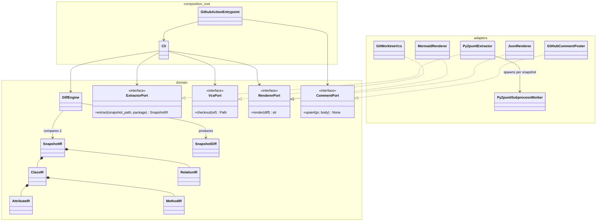

# design-diff アーキテクチャ設計

ステータス: `need-review`(司令塔レビュー待ち。承認まで実装フェーズには進まない)
作成日: 2026-08-19

## 0. この文書の位置づけ

CLAUDE.md のミッション・技術方針・MVPスコープを前提に、実装着手前の設計を確定する。
特に以下の3点は**実測に基づいて決めた**(推測で書いていない):

1. py2puml をライブラリとして組み込めるか → **組み込める**(§5)
2. その際に踏んではいけない罠は何か → **2つ実測で発見した**(§5.2, §5.3)
3. 中間表現(IR)に何を入れられるか → py2puml の実データ構造に基づいて確定(§3)

---

## 1. ナラティブとスコープの再確認

AIがコードを書く時代、人間のレビューは行diffから設計diffへ上がる。「500行変わった」ではなく
「このクラスが増え、この依存が生えた」を見せるのが design-diff の価値。

MVPが扱うのは **クラス・属性・メソッド・継承・コンポジション依存の増減** であり、
リネーム検出・列挙型(Enum)・振る舞いの意味的変化(メソッド本体の中身)は対象外とする
(§4.4, §7 に理由を明記)。

---

## 2. レイヤー構成

クリーンアーキテクチャに沿い、**ドメイン層は py2puml・git・GitHub API・Mermaid/JSON の
どれにも依存しない**。抽出・VCS操作・レンダリング・PR投稿はすべてアダプタ層に隔離する。



- **domain/**: `ClassIR` `AttributeIR` `MethodIR` `RelationIR` `SnapshotIR`(中間表現)、
  `SnapshotDiff` とその算出ロジック(`DiffEngine`)、および4つのポート(interface)。
  外部ライブラリ import 一切禁止(標準ライブラリの `dataclasses` / `typing` 等は可)。
- **adapters/**: ポートの実装。`extraction/`(py2puml)、`vcs/`(git worktree)、
  `rendering/`(Mermaid・JSON)、`github/`(PRコメント upsert)。
  相互に import しない(extraction が rendering を知る必要はない)。
- **composition root**(`cli/` と `action/`): ポートの実装を選んで注入し、
  ドメインを呼び出して結果を出力する。ここだけが adapters と domain の両方を知ってよい。

---

## 3. 中間表現(IR)スキーマ

py2puml の実データ構造(§5実測)をそのまま反映する。過剰な抽象化はしない。

```python
# domain/model.py (イメージ。実装フェーズで確定)

@dataclass(frozen=True)
class AttributeIR:
    name: str
    type: str          # py2pumlが返す文字列型(例: "List[Wheel]") をそのまま使う
    static: bool

@dataclass(frozen=True)
class ParameterIR:
    name: str
    type: str | None

@dataclass(frozen=True)
class MethodIR:
    name: str
    parameters: tuple[ParameterIR, ...]
    return_type: str | None

@dataclass(frozen=True)
class ClassIR:
    fqn: str            # 完全修飾名。IRの一次キー
    name: str
    is_abstract: bool
    attributes: tuple[AttributeIR, ...]
    methods: tuple[MethodIR, ...]

class RelationType(Enum):
    INHERITANCE = "inheritance"
    COMPOSITION = "composition"

@dataclass(frozen=True)
class RelationIR:
    source_fqn: str
    target_fqn: str
    type: RelationType

@dataclass(frozen=True)
class SnapshotIR:
    package: str
    classes: dict[str, ClassIR]     # key = fqn
    relations: frozenset[RelationIR]
```

### 3.1 なぜ fqn をキーにするか

py2puml 自体が `items_by_fqn: Dict[str, UmlItem]` という形で fqn をキーにしている
(§5.1実測)。これに素直に乗ることで抽出アダプタの変換コストを最小化する。

### 3.2 methods フィールドについて(py2pumlにはない機能を追加する判断)

**実測の結果、py2puml は属性・継承・コンポジションは構造化データとして返すが、
メソッドは一切抽出しない**(§5.4)。CLAUDE.md のミッションは「クラス・属性・メソッド…」
と明記しているため、IRには methods を持たせ、**抽出アダプタ内で標準ライブラリ
`inspect.getmembers` + `inspect.signature` による軽量な補助抽出を行う**
(§5.4で動作確認済み)。これは py2puml の内部APIには依存しない別処理であり、
「py2puml依存を閉じ込める」というCLAUDE.mdの方針には抵触しない
(同じ extraction アダプタ内に閉じ込まっている)。

### 3.3 リレーションの表現

`RelationIR` は `(source_fqn, target_fqn, type)` の3つ組で、`SnapshotIR.relations` は
**frozenset**(集合)として持つ。py2puml も1クラス内では同一ターゲットへの複数属性を
1つのCOMPOSITIONに重複排除する実装になっている(§5.1実測: `wheels: List[Wheel]` と
`spare_wheel: Optional[Wheel]` が両方 `Wheel` を指すが、リレーションは1本だけ生成された)。
IR側でも同じ重複排除方針を踏襲する。

### 3.4 リネーム検出について(MVP対象外)

MVPでは **リネームは「削除+追加」として扱う**。理由:

- fqn一致による識別は決定的でヒューリスティックな誤判定がない
- リネーム検出(属性集合のJaccard類似度等)は false positive のリスクがあり、
  「設計diffが信頼できる」というツールの価値の根幹を損ないかねない
- 将来 opt-in の類似度ヒューリスティックとして追加する余地は残す(IR設計上のブロッカーではない)

### 3.5 Enum について(MVP対象外)

py2puml は `UmlClass` とは別に `UmlEnum` を返す(§5実装コード確認)。MVPは
`UmlClass` 由来の `ClassIR` のみを対象とし、Enum は無視する。理由: ミッション文が
「クラス構造」と明言しており、Enumの増減はクラス図の本質的な差分ではないため。
将来的にIRに `EnumIR` を追加するのは非破壊的な拡張なので後回しにして問題ない。

---

## 4. Diffアルゴリズム(ドメイン層)

`DiffEngine.diff(base: SnapshotIR, head: SnapshotIR) -> SnapshotDiff`

### 4.1 クラスの差分

fqnの集合演算のみ:

- `added`   = head.classes.keys() − base.classes.keys()
- `removed` = base.classes.keys() − head.classes.keys()
- `modified` = 両方に存在し、`ClassIR` が等しくない(dataclassの構造的等価性で判定)fqn
  → 属性差分・メソッド差分・`is_abstract` 変更を個別に算出(4.2, 4.3)
- 両方に存在し完全一致するクラスは**出力しない**(codiff-action方式の沈黙原則。§6, §8)

### 4.2 属性差分(modified クラス内)

属性は `name` をキーに base/head を突き合わせる:

- 追加属性: head にあって base にない name
- 削除属性: base にあって head にない name
- 型変更: 同じ name で `type` または `static` が異なる → `{name, old_type, new_type}`

### 4.3 メソッド差分(modified クラス内)

属性と同じ方式。`name` をキーに追加/削除/シグネチャ変更(`parameters` または
`return_type` の差)を検出する。オーバーロード(同名複数定義)はPythonでは基本的に
発生しない(後勝ちで1つになる)ため、name一意を前提にしてよい。

### 4.4 リレーションの差分

`RelationIR` は3つ組全体で同一性判定するため、単純な集合差分:

- `added`   = head.relations − base.relations
- `removed` = base.relations − head.relations
- 「変更」という概念はない(3つ組が変わったら別のリレーション = 追加+削除)

---

## 5. py2puml 技術検証

検証スクリプトは `docs/design/spikes/py2puml_verification.py`、実行ログは
`docs/design/spikes/py2puml_verification_output.txt` に保存(`uv run python
docs/design/spikes/py2puml_verification.py` で再実行可能)。

### 5.1 ライブラリとして構造化データが取れるか → **取れる**

```python
from py2puml.domain.inspection import Inspection
from py2puml.inspector import Inspector

inspection = Inspection({}, [])
list(Inspector(root, root / "sample", "sample").inspect(inspection))
# inspection.items_by_fqn: Dict[str, UmlClass | UmlEnum]
# inspection.relations:    List[UmlRelation]
```

`Inspector.inspect()` は PlantUML テキスト行を yield するジェネレータだが、
**その副作用として渡した `Inspection` タプルに構造化データを書き込む**。
ジェネレータを `list()` で消費するだけで、テキストパースなしに以下が手に入ることを実測確認した:

```
sample.models.Car -> UmlClass(
    name='Car', fqn='sample.models.Car',
    attributes=[
        UmlAttribute(name='engine', type='Engine', static=False),
        UmlAttribute(name='wheels', type='List[Wheel]', static=False),
        UmlAttribute(name='spare_wheel', type='Optional[Wheel]', static=False),
    ],
    is_abstract=False)

UmlRelation(source_fqn='sample.models.Car', target_fqn='sample.models.Engine', type=COMPOSITION)
UmlRelation(source_fqn='sample.models.Car', target_fqn='sample.models.Wheel', type=COMPOSITION)
UmlRelation(source_fqn='sample.models.Vehicle', target_fqn='sample.models.Car', type=INHERITANCE)
```

継承(`<|--`)・コンポジション(`*--`)ともに正しく抽出された。
→ **PlantUMLテキストのパースへのフォールバックは不要と判断する。**
ライブラリ組み込みの方が構造化データを直接得られ、テキストのパース処理という
不要な変換層を挟まずに済むため、CLAUDE.mdの「フォールバック可」条項は使わない。

### 5.2 罠1: パスをsymlink解決してから渡さないと無言でクラスが消える

`Inspector.__init__` は `root_domain_path` を内部で `.resolve()` するが、
`sys.path` に積む `inspection_working_directory` は**呼び出し側から渡された値をそのまま**使う。
このため未解決パス(例: macOSの `/tmp` → `/private/tmp`、`/var` → `/private/var` という
symlink)を渡すと、import されたモジュールの `__file__`(未解決パス)と
`root_domain_path`(解決済みパス)が食い違い、`_filter_module_definitions` 内の
`Path(definition_file).relative_to(self.root_domain_path)` が `ValueError` になって
**例外もログも出さずに対象クラスがフィルタで除外される**(実測: `Python`
`tempfile.TemporaryDirectory()` が返す `/var/folders/...` で発症、`.resolve()` で解消)。

→ **設計判断**: `extraction/py2puml_extractor.py`(および git worktree アダプタ)は、
Inspector に渡す**すべてのパスを必ず `.resolve()` してから渡す**ことをコーディング規約とする。
CI環境(Linuxコンテナ)でも `/tmp` がsymlinkの場合があるため一般的な防御として必須。

### 5.3 罠2: base/headを同一プロセスで連続inspectすると衝突する(重要・致命的)

base と head で **同じdotted module name**(例: `sample.models`)を同一プロセス内で
2回 `import_module()` すると、2回目は `sys.modules` のキャッシュが返る。
キャッシュされたモジュールの `__file__` は最初にimportした時点のファイルパスのままなので、
2回目の inspect が期待するファイルパスと一致せず、**そのモジュールのクラスが全て
消える**ことを実測で確認した(base側・head側の両方が影響を受けうる。実測ログでは
先行する別検証が `sample.models` を import 済みだったため、後続の base 抽出時点で
既にクラスが0件になった)。

→ **設計判断(必須・アーキテクチャ上のクリティカルパス)**: `Py2pumlExtractor` は
base/head それぞれを**別プロセス**で抽出する(`subprocess` でワーカースクリプトを起動し、
結果をJSONでstdout経由に返す)。同一プロセス内で `Inspector` を複数回呼ぶ実装は禁止。
これをドメイン層のポート契約にも反映する:
`ExtractorPort.extract()` は1回の呼び出しにつき1スナップショットのみを扱い、
呼び出し元(CLI)が2回呼ぶ設計とする(アダプタ内部でプロセス分離を隠蔽する)。

### 5.4 メソッド抽出(py2pumlの範囲外の補助実装)

py2puml の `UmlClass` は `attributes` のみを持ち、メソッド一覧は含まない
(`domain/umlclass.py` のデータクラス定義で確認)。標準ライブラリでの代替を実測:

```python
import inspect
for name, fn in inspect.getmembers(Car, predicate=inspect.isfunction):
    print(name, inspect.signature(fn))
# => __init__ (self, name: str, engine: sample.models.Engine)
```

動作確認済み。`Py2pumlExtractor` は py2puml の `Inspector` が既に import 済みの
クラスオブジェクトを使って、この `inspect` ベースの補助抽出を同じサブプロセス内で
追加実行し、`MethodIR` を埋める(§3.2)。

### 5.5 実行時コード実行についての注意(リスクとして明記)

`Inspector._inspect_module` は対象パッケージを **実際に `import_module()` する**、
つまり**対象コードのモジュールレベルの文・デコレータ・メタクラスを実行する**。
これは信頼できない外部PRのコードに対してCIで実行する場合、コード実行のリスクを伴う
(py2pumlに限らずAST直読みでない構造抽出ツール全般に共通する制約ではあるが、
明記しておく)。MVPでは「organizationの自リポジトリのPRに対して実行する」ことを
前提とし、フォークPR(外部コントリビュータ)からの実行は**GitHub Actionの権限設計で
別途ガードする**(例: `pull_request_target` を安易に使わない、シークレットを渡さない)。
この点は §8 リスクにも記載し、Action実装フェーズで司令塔に再確認する。

### 5.6 動作確認したPythonバージョン制約

`py2puml==0.11.0` は `Requires-Python: >=3.10.9`。本リポジトリは `uv init` で
`requires-python = ">=3.12"` になっており矛盾しない。

---

## 6. JSON出力スキーマ(LLMO設計)

AIレビュアーがそのまま読める自己完結JSONを1コマンドで出力する。

```jsonc
{
  "schema_version": "1.0",
  "tool": "design-diff",
  "package": "sample",
  "base_ref": "main",
  "head_ref": "feature/xxx",
  "has_changes": true,
  "summary": {
    "classes_added": 1,
    "classes_removed": 0,
    "classes_modified": 1,
    "relations_added": 1,
    "relations_removed": 1
  },
  "classes": {
    "added": [
      { "fqn": "sample.models.Battery", "name": "Battery",
        "attributes": [{ "name": "capacity_kwh", "type": "float", "static": false }],
        "methods": [] }
    ],
    "removed": [],
    "modified": [
      { "fqn": "sample.models.Car", "name": "Car",
        "attributes": { "added": [{ "name": "battery", "type": "Battery", "static": false }],
                         "removed": [{ "name": "wheels", "type": "List[Wheel]", "static": false }],
                         "changed": [] },
        "methods": { "added": [], "removed": [], "changed": [] } }
    ]
  },
  "relations": {
    "added":   [{ "source_fqn": "sample.models.Car", "target_fqn": "sample.models.Battery", "type": "composition" }],
    "removed": [{ "source_fqn": "sample.models.Car", "target_fqn": "sample.models.Wheel",    "type": "composition" }]
  },
  "mermaid": "```mermaid\nclassDiagram\n...\n```"
}
```

- `has_changes: false` の場合、GitHub Actionはコメントを投稿しない(沈黙原則。§8)。
- `mermaid` にレンダリング済みのMermaidブロックを文字列として同梱し、
  JSON単体でも人間可読な図をAIレビュアーが再現できるようにする(README冒頭の1文と対になる設計)。
- `schema_version` はフィールド追加時のみ変更(破壊的変更ではmajorを上げる)。

---

## 7. Mermaid classDiagram レンダリング方針

- 3状態を `classDef` + `cssClass` で色分け: 追加=緑、削除=赤、変更=黄
- `modified` クラスは head 時点の全属性を表示しつつ、変更差分は `+`/`-` プレフィックスで
  属性行に表現する(git diff的な可読性を優先し、Mermaid標準記法の範囲に収める)
- 変更のないクラスは図に出さない(ノイズ削減。§8の沈黙原則と一貫)
- リレーションは `A *-- B`(コンポジション)/ `A <|-- B`(継承)のMermaid記法にマッピング

---

## 8. import-linter 契約案

```ini
[importlinter]
root_package = design_diff

[importlinter:contract:layers]
name = レイヤー依存方向の強制
type = layers
layers =
    design_diff.cli | design_diff.action
    design_diff.adapters
    design_diff.domain

[importlinter:contract:domain-purity]
name = ドメイン層は外部ライブラリ・アダプタに依存しない
type = forbidden
source_modules = design_diff.domain
forbidden_modules =
    py2puml
    git
    github
    subprocess
    design_diff.adapters
    design_diff.cli
    design_diff.action

[importlinter:contract:adapters-independence]
name = アダプタ同士は互いに依存しない(extraction/vcs/rendering/githubは独立)
type = independence
modules =
    design_diff.adapters.extraction
    design_diff.adapters.vcs
    design_diff.adapters.rendering
    design_diff.adapters.github
```

`layers` 契約は上位(cli/action)→中位(adapters)→下位(domain)の一方向のみ許可。
`forbidden` 契約でドメイン層への第三者ライブラリ混入を機械的に禁止する
(§5.5のリスクと合わせ、ドメイン層のテスト容易性・90%カバレッジ目標を担保する土台になる)。
CIでこの設定を緩めることは司令塔承認なしに行わない(CLAUDE.md方針の通り)。

---

## 9. リスク・注意点まとめ

| リスク | 内容 | 対応方針 |
|---|---|---|
| プロセス分離漏れ | base/headを同一プロセスでinspectすると無言で結果が壊れる(§5.3実測) | `ExtractorPort`実装は1呼び出し1スナップショット固定、サブプロセス必須。ユニットテストで「同一プロセスで2回呼んだら例外/検知」のガードを入れることを検討 |
| パス未解決 | symlink未解決パスで無言でクラス消失(§5.2実測) | アダプタ内で必ず`.resolve()`。回帰テストをdocs/design/spikesのシナリオをベースに追加 |
| 対象コードの実行 | py2pumlはimport_moduleで対象コードを実行する(§5.5) | MVPは自リポジトリPR限定。フォークPRからの実行はAction設計フェーズで別途ガード策を司令塔と確認 |
| 型アノテーションなしコードで依存が出ない | py2pumlは型アノテーション起点で依存を抽出 | READMEに正直に明記(CLAUDE.md既定方針どおり) |
| メソッド抽出はpy2puml範囲外 | 独自にinspectベースの補助実装が必要(§3.2, §5.4) | extraction層に閉じ込め、ドメインへの影響なし |

---

## 10. 未決事項(実装フェーズで判断が必要)

- CLIフレームワーク(argparse vs Typer)は未決定。実装フェーズで軽量なargparseを既定案とし、
  必要なら司令塔に確認する
- サブプロセス間のシリアライズ形式(JSON前提)の詳細スキーマは実装時にドメインIRの
  dataclassから機械的に導出する
- GitHub Actionのフォークpull_request対応方針(§5.5, §9)は実装フェーズで再確認

---

## 11. 検証根拠ファイル

- `docs/design/spikes/py2puml_verification.py` — 再実行可能な検証スクリプト
- `docs/design/spikes/py2puml_verification_output.txt` — 実行ログ(2026-08-19取得)
