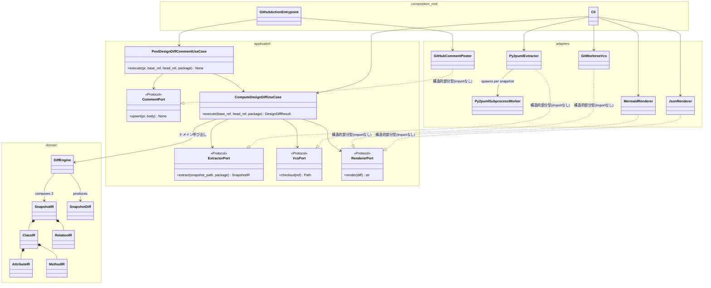

# design-diff アーキテクチャ設計

ステータス: 実装済み(この文書はMVP実装完了時点の設計を反映している)
作成日: 2026-08-19 / 最終改訂: 2026-08-19

## 0.1 改訂履歴(v1 → v2)

設計レビューで出た指摘1〜3を全面的に反映した。

| # | 指摘 | 対応 |
|---|---|---|
| 1 | メソッド抽出が継承メソッドまで拾ってノイズ・誤検出の原因になる | §3.2, §5.4 を実測付きで全面改訂。「クラス自身が定義したメンバーのみ」に絞る規則を明記 |
| 2 | ポートの置き場所が誤り(domainはポートを使わない)。application層を追加 | §2 をレイヤー構成に application を追加して全面改訂。ポートは `typing.Protocol` で application に定義し、adapters は import せずに構造的部分型で実装する設計にした(理由は §2.2) |
| 3 | LLMO設計が不足(README一文・llms.txt/AGENTS.md/SKILL.md・MCP化の要否) | §12 を新設 |

## 0. この文書の位置づけ

CLAUDE.md のミッション・技術方針・MVPスコープを前提に、実装着手前の設計を確定する。
特に以下の3点は**実測に基づいて決めた**(推測で書いていない):

1. py2puml をライブラリとして組み込めるか → **組み込める**(§5)
2. その際に踏んではいけない罠は何か → **2つ実測で発見した**(§5.2, §5.3)
3. 中間表現(IR)に何を入れられるか → py2puml の実データ構造に基づいて確定(§3)

---

## 1. ナラティブとスコープの再確認

AIがコードを書く時代、人間のレビューは行diffから設計diffへ上がる。「500行変わった」ではなく
「このクラスが増え、この依存が生えた」を見せるのが design-diff の価値。

MVPが扱うのは **クラス・属性・メソッド・継承・コンポジション依存の増減** であり、
リネーム検出・列挙型(Enum)・振る舞いの意味的変化(メソッド本体の中身)は対象外とする
(§3.4, §3.5 に理由を明記)。

---

## 2. レイヤー構成(v2: application層を追加)

v1では4つのポート(interface)を domain に置いていたが、レビューでの指摘の通り
**DiffEngineはどのポートも呼ばない**(SnapshotIRを2つ受け取ってSnapshotDiffを返すだけの
純粋関数的ロジック)。ポートを必要とするのはオーケストレーション(ユースケース)であって
ドメインではないため、**application層を新設してポートとユースケースをそこに移した**。

クリーンアーキテクチャに沿い、**domain は誰にも依存しない。application は domain にのみ
依存する(adaptersを知らない)。adapters は application のポート定義に構造的に適合するが
importはしない(§2.2)。composition root(cli/action)だけが全部を知る。**



- **domain/**: `ClassIR` `AttributeIR` `MethodIR` `RelationIR` `SnapshotIR`(中間表現)、
  `SnapshotDiff` とその算出ロジック(`DiffEngine`)のみ。ポートは置かない。
  外部ライブラリ import 一切禁止(標準ライブラリの `dataclasses` / `typing` 等は可)。
- **application/**: `ports.py`(`ExtractorPort` `VcsPort` `RendererPort` `CommentPort`、
  すべて `typing.Protocol`)と、`use_cases/`(`ComputeDesignDiffUseCase` /
  `PostDesignDiffCommentUseCase`)。domain のみに依存し、adapters を import しない。
  「どのポートをどの順で呼ぶか」というオーケストレーションはここに閉じ込め、
  CLI/Actionからロジックを追い出す(指摘2の核心)。
- **adapters/**: ポートの実装。`extraction/`(py2puml)、`vcs/`(git worktree)、
  `rendering/`(Mermaid・JSON)、`github/`(PRコメント upsert)。
  相互に import しない(extraction が rendering を知る必要はない)。
  application の Protocol を **import しない**(§2.2)。domain は import してよい
  (IRオブジェクトを組み立てる必要があるため)。
- **composition root**(`cli/` と `action/`): 引数解析・環境変数読み取りと、
  アダプタ実装を選んでユースケースに注入する薄い殻。ロジックを持たない
  (指摘2「CLI/Actionは引数解析と注入だけ」を反映)。ここだけが application と
  adapters の両方を知ってよい。

### 2.1 ユースケースの分離

- `ComputeDesignDiffUseCase.execute(base_ref, head_ref, package) -> DesignDiffResult`
  (`DesignDiffResult` = `{diff: SnapshotDiff, mermaid: str, json_payload: dict}`)。
  VCSチェックアウト→抽出(base/head別プロセス、§5.3)→`DiffEngine.diff()`→レンダリング、
  という一連の流れをここに閉じ込める。CLIはこれを呼んで標準出力するだけ。
- `PostDesignDiffCommentUseCase.execute(pr, base_ref, head_ref, package) -> None`:
  `ComputeDesignDiffUseCase` を内部で使い、`diff.has_changes` が真の場合のみ
  `CommentPort.upsert()` を呼ぶ(沈黙原則 §4.1 をユースケースのルールとして表現し、
  composition rootにif文を書かせない)。**沈黙するのは `has_changes` が false
  かつ `diff.warnings` が空の場合のみ**(実戦テストで発見した回帰: サブモジュール
  のimport失敗が無言でスキップされると、部分解析であるにもかかわらず「変更なし」
  として沈黙してしまい、沈黙原則の前提『沈黙=変更なし』が崩れる。§4.1参照)。
- E2E(実際のgit worktree・実際のpy2puml実行)を待たずに、
  フェイクの `VcsPort`/`ExtractorPort`/`RendererPort` 実装を注入した
  ユースケース単体テストが書ける(指摘2「TDDの回しやすさが段違い」に対応)。

### 2.2 なぜポートを Protocol にしたか(ABCではなく)

レビューで決まった4層順序(`cli|action → application → adapters → domain`)を import-linter の
`layers` 契約にそのまま採用すると、**adapters は application を import できない**
(layers契約は「上位は下位をimportしてよいが逆は不可」であり、この並びでは adapters は
application より下位になるため)。これは一見、「adaptersがapplicationのポートを
実装する」という通常のDIP(依存性逆転)のやり方(ABCを継承する)と矛盾するように見えるが、
**`typing.Protocol` による構造的部分型を使えば adapters は application を1行も
import せずにポートを満たせる**ことを実測で確認した
(`docs/design/spikes/protocol_layering_verification.py`)。
これにより、レビューで決まった層順序をそのまま import-linter で機械的に強制でき、かつ
DIPの精神(=applicationは具体的な実装を知らない)も正しく守られる。
composition root(cli/action)だけが両方をimportして束ねる。

---

## 3. 中間表現(IR)スキーマ

py2puml の実データ構造(§5実測)をそのまま反映する。過剰な抽象化はしない。

```python
# domain/model.py (イメージ。実装フェーズで確定)

@dataclass(frozen=True)
class AttributeIR:
    name: str
    type: str          # py2pumlが返す文字列型(例: "List[Wheel]") をそのまま使う
    static: bool

@dataclass(frozen=True)
class ParameterIR:
    name: str
    type: str | None

@dataclass(frozen=True)
class MethodIR:
    name: str
    parameters: tuple[ParameterIR, ...]
    return_type: str | None

@dataclass(frozen=True)
class ClassIR:
    fqn: str            # 完全修飾名。IRの一次キー
    name: str
    is_abstract: bool
    attributes: tuple[AttributeIR, ...]
    methods: tuple[MethodIR, ...]

class RelationType(Enum):
    INHERITANCE = "inheritance"
    COMPOSITION = "composition"

@dataclass(frozen=True)
class RelationIR:
    source_fqn: str
    target_fqn: str
    type: RelationType

@dataclass(frozen=True)
class SnapshotIR:
    package: str
    classes: dict[str, ClassIR]     # key = fqn
    relations: frozenset[RelationIR]
    skipped_modules: tuple[str, ...] = ()  # importに失敗し除外されたサブモジュール名
```

**`skipped_modules`(実戦テストで発見した回帰への対応)**: サブモジュールの
importに失敗した場合、抽出アダプタは(以前のように)解析全体を止めず、他の
モジュールの解析を続けるが、失敗したモジュール名をここに記録する。これが
空でない場合、`classes`/`relations` は対象パッケージ全体を網羅していない
(部分解析)。`DiffEngine.diff()` は base/head 双方の `skipped_modules` を
マージして `SnapshotDiff.warnings` とし、沈黙原則(§2.1, §4.1)の判定に使う。

### 3.1 なぜ fqn をキーにするか

py2puml 自体が `items_by_fqn: Dict[str, UmlItem]` という形で fqn をキーにしている
(§5.1実測)。これに素直に乗ることで抽出アダプタの変換コストを最小化する。

### 3.2 methods フィールドについて(py2pumlにはない機能を追加する判断)

**実測の結果、py2puml は属性・継承・コンポジションは構造化データとして返すが、
メソッドは一切抽出しない**(§5.4)。CLAUDE.md のミッションは「クラス・属性・メソッド…」
と明記しているため、IRには methods を持たせ、**抽出アダプタ内で標準ライブラリの
`inspect` による軽量な補助抽出を行う**(§5.4で動作確認済み)。これは py2puml の
内部APIには依存しない別処理であり、「py2puml依存を閉じ込める」というCLAUDE.mdの
方針には抵触しない(同じ extraction アダプタ内に閉じ込まっている)。

**指摘1(必須修正・v2で反映)**: 当初案の `inspect.getmembers(cls,
predicate=inspect.isfunction)` は **MRO(継承元)を辿って基底クラスのメソッドまで
返してしまう**ことを実測で確認した(§5.4)。このままdiffの判定単位に使うと、

- (a) 全サブクラスの図に基底クラスのメソッドが重複表示されノイズになる
- (b) 基底クラスのメソッドを1つ変更しただけで、全サブクラスが「modified」として
  誤検出される(実際に構造が変わったのはサブクラスではなく基底クラスなのに)

という実害がある。**対策: `cls.__dict__`(= `vars(cls)`)を直接見て、
そのクラス自身が定義したメンバーだけをメソッド抽出の対象にする**規則を採用する
(§5.4で `vars(cls)` 方式が継承メソッドを含まないことを実測確認済み。
副産物として `classmethod` の取りこぼしも解消された)。
**継承メソッドをMermaid図に「参考情報として」出すかどうかは別問題として保留してよいが、
少なくとも diff(added/removed/changed)の判定は必ず自クラス定義分のみで行う**
(指摘1の必須要件)。

### 3.3 リレーションの表現

`RelationIR` は `(source_fqn, target_fqn, type)` の3つ組で、`SnapshotIR.relations` は
**frozenset**(集合)として持つ。py2puml も1クラス内では同一ターゲットへの複数属性を
1つのCOMPOSITIONに重複排除する実装になっている(§5.1実測: `wheels: List[Wheel]` と
`spare_wheel: Optional[Wheel]` が両方 `Wheel` を指すが、リレーションは1本だけ生成された)。
IR側でも同じ重複排除方針を踏襲する。

### 3.4 リネーム検出について(MVP対象外)

MVPでは **リネームは「削除+追加」として扱う**。理由:

- fqn一致による識別は決定的でヒューリスティックな誤判定がない
- リネーム検出(属性集合のJaccard類似度等)は false positive のリスクがあり、
  「設計diffが信頼できる」というツールの価値の根幹を損ないかねない
- 将来 opt-in の類似度ヒューリスティックとして追加する余地は残す(IR設計上のブロッカーではない)

### 3.5 Enum について(MVP対象外)

py2puml は `UmlClass` とは別に `UmlEnum` を返す(§5実装コード確認)。MVPは
`UmlClass` 由来の `ClassIR` のみを対象とし、Enum は無視する。理由: ミッション文が
「クラス構造」と明言しており、Enumの増減はクラス図の本質的な差分ではないため。
将来的にIRに `EnumIR` を追加するのは非破壊的な拡張なので後回しにして問題ない。

---

## 4. Diffアルゴリズム(ドメイン層)

`DiffEngine.diff(base: SnapshotIR, head: SnapshotIR) -> SnapshotDiff`

### 4.1 クラスの差分

fqnの集合演算のみ:

- `added`   = head.classes.keys() − base.classes.keys()
- `removed` = base.classes.keys() − head.classes.keys()
- `modified` = 両方に存在し、`ClassIR` が等しくない(dataclassの構造的等価性で判定)fqn
  → 属性差分・メソッド差分・`is_abstract` 変更を個別に算出(4.2, 4.3)
- 両方に存在し完全一致するクラスは**出力しない**(codiff-action方式の沈黙原則。§2.1, §6)
- `SnapshotDiff.warnings` = base/head双方の `SnapshotIR.skipped_modules` の和集合
  (重複排除・ソート済み)。沈黙原則は『沈黙=変更なし』が真であることに依存して
  おり、部分解析(warningsが非空)を無言のまま扱うとこの前提が壊れるため、
  沈黙するのは `has_changes` が false **かつ** `warnings` が空の場合のみ
  (実戦テストで発見した回帰への対応。§2.1参照)

### 4.2 属性差分(modified クラス内)

属性は `name` をキーに base/head を突き合わせる:

- 追加属性: head にあって base にない name
- 削除属性: base にあって head にない name
- 型変更: 同じ name で `type` または `static` が異なる → `{name, old_type, new_type}`

### 4.3 メソッド差分(modified クラス内)

属性と同じ方式。`name` をキーに追加/削除/シグネチャ変更(`parameters` または
`return_type` の差)を検出する。オーバーロード(同名複数定義)はPythonでは基本的に
発生しない(後勝ちで1つになる)ため、name一意を前提にしてよい。

### 4.4 リレーションの差分

`RelationIR` は3つ組全体で同一性判定するため、単純な集合差分:

- `added`   = head.relations − base.relations
- `removed` = base.relations − head.relations
- 「変更」という概念はない(3つ組が変わったら別のリレーション = 追加+削除)

---

## 5. py2puml 技術検証

検証スクリプトは `docs/design/spikes/py2puml_verification.py`、実行ログは
`docs/design/spikes/py2puml_verification_output.txt` に保存(`uv run python
docs/design/spikes/py2puml_verification.py` で再実行可能)。

### 5.1 ライブラリとして構造化データが取れるか → **取れる**

```python
from py2puml.domain.inspection import Inspection
from py2puml.inspector import Inspector

inspection = Inspection({}, [])
list(Inspector(root, root / "sample", "sample").inspect(inspection))
# inspection.items_by_fqn: Dict[str, UmlClass | UmlEnum]
# inspection.relations:    List[UmlRelation]
```

`Inspector.inspect()` は PlantUML テキスト行を yield するジェネレータだが、
**その副作用として渡した `Inspection` タプルに構造化データを書き込む**。
ジェネレータを `list()` で消費するだけで、テキストパースなしに以下が手に入ることを実測確認した:

```
sample.models.Car -> UmlClass(
    name='Car', fqn='sample.models.Car',
    attributes=[
        UmlAttribute(name='engine', type='Engine', static=False),
        UmlAttribute(name='wheels', type='List[Wheel]', static=False),
        UmlAttribute(name='spare_wheel', type='Optional[Wheel]', static=False),
    ],
    is_abstract=False)

UmlRelation(source_fqn='sample.models.Car', target_fqn='sample.models.Engine', type=COMPOSITION)
UmlRelation(source_fqn='sample.models.Car', target_fqn='sample.models.Wheel', type=COMPOSITION)
UmlRelation(source_fqn='sample.models.Vehicle', target_fqn='sample.models.Car', type=INHERITANCE)
```

継承(`<|--`)・コンポジション(`*--`)ともに正しく抽出された。
→ **PlantUMLテキストのパースへのフォールバックは不要と判断する。**
ライブラリ組み込みの方が構造化データを直接得られ、テキストのパース処理という
不要な変換層を挟まずに済むため、CLAUDE.mdの「フォールバック可」条項は使わない。

### 5.2 罠1: パスをsymlink解決してから渡さないと無言でクラスが消える

`Inspector.__init__` は `root_domain_path` を内部で `.resolve()` するが、
`sys.path` に積む `inspection_working_directory` は**呼び出し側から渡された値をそのまま**使う。
このため未解決パス(例: macOSの `/tmp` → `/private/tmp`、`/var` → `/private/var` という
symlink)を渡すと、import されたモジュールの `__file__`(未解決パス)と
`root_domain_path`(解決済みパス)が食い違い、`_filter_module_definitions` 内の
`Path(definition_file).relative_to(self.root_domain_path)` が `ValueError` になって
**例外もログも出さずに対象クラスがフィルタで除外される**(実測: `Python`
`tempfile.TemporaryDirectory()` が返す `/var/folders/...` で発症、`.resolve()` で解消)。

→ **設計判断**: `extraction/py2puml_extractor.py`(および git worktree アダプタ)は、
Inspector に渡す**すべてのパスを必ず `.resolve()` してから渡す**ことをコーディング規約とする。
CI環境(Linuxコンテナ)でも `/tmp` がsymlinkの場合があるため一般的な防御として必須。

### 5.3 罠2: base/headを同一プロセスで連続inspectすると衝突する(重要・致命的)

base と head で **同じdotted module name**(例: `sample.models`)を同一プロセス内で
2回 `import_module()` すると、2回目は `sys.modules` のキャッシュが返る。
キャッシュされたモジュールの `__file__` は最初にimportした時点のファイルパスのままなので、
2回目の inspect が期待するファイルパスと一致せず、**そのモジュールのクラスが全て
消える**ことを実測で確認した(base側・head側の両方が影響を受けうる。実測ログでは
先行する別検証が `sample.models` を import 済みだったため、後続の base 抽出時点で
既にクラスが0件になった)。

→ **設計判断(必須・アーキテクチャ上のクリティカルパス)**: `Py2pumlExtractor` は
base/head それぞれを**別プロセス**で抽出する(`subprocess` でワーカースクリプトを起動し、
結果をJSONでstdout経由に返す)。同一プロセス内で `Inspector` を複数回呼ぶ実装は禁止。
これを application 層のポート契約にも反映する(v2で domain から application に移設。§2):
`ExtractorPort.extract()` は1回の呼び出しにつき1スナップショットのみを扱い、
呼び出し元の `ComputeDesignDiffUseCase`(§2.1)が base/head で2回呼ぶ設計とする
(アダプタ内部でプロセス分離を隠蔽する)。

### 5.4 メソッド抽出(py2pumlの範囲外の補助実装、指摘1でv2改訂)

py2puml の `UmlClass` は `attributes` のみを持ち、メソッド一覧は含まない
(`domain/umlclass.py` のデータクラス定義で確認)。標準ライブラリでの代替を実測:

```python
import inspect

class Vehicle:
    def __init__(self, name: str): ...
    def drive(self): ...

class Car(Vehicle):
    def honk(self): ...
    @staticmethod
    def static_helper(): ...
    @classmethod
    def from_name(cls, name): ...

# 当初案: inspect.getmembers(Car, predicate=inspect.isfunction)
# => __init__ (Vehicle.__init__), drive (Vehicle.drive), honk (Car.honk), static_helper (Car.static_helper)
#    ★ Vehicle由来のメソッドまで含まれる(継承漏れ)。さらに classmethod の from_name は
#      isfunction述語に一致せず取りこぼされる(別の実害)。

# 採用案: vars(Car) (= Car.__dict__) を直接見る
# => honk (function), static_helper (staticmethod), from_name (classmethod)
#    ★ Carが自分で定義したメンバーだけが列挙される。classmethod/staticmethodも正しく拾える。
```

両方式を実測比較し、`vars(cls)` 方式に決定した(§3.2)。抽出アルゴリズム:

```python
def own_methods(cls: type) -> list[MethodIR]:
    methods = []
    for name, obj in vars(cls).items():
        if isinstance(obj, staticmethod):
            fn = obj.__func__
        elif isinstance(obj, classmethod):
            fn = obj.__func__
        elif inspect.isfunction(obj):
            fn = obj
        else:
            continue  # プロパティ・クラス変数などは対象外(属性側で別途扱う)
        methods.append(_to_method_ir(name, fn))
    return methods
```

`Py2pumlExtractor` は py2puml の `Inspector` が既に import 済みのクラスオブジェクトを
使って、この `inspect` ベースの補助抽出を同じサブプロセス内で追加実行し、
`MethodIR` を埋める(§3.2)。

**回帰テスト(実装フェーズでTDDの対象とする。指摘1「回帰テストも必須」に対応)**:

1. `Vehicle.drive` を持つ `Car(Vehicle)` を解析 → `Car` の `methods` に `drive` が
   含まれない(継承メソッドを拾わないことの確認)
2. 上記の状態から `Vehicle.drive` のシグネチャだけを変更 → `Car` の diff結果に
   `modified` として現れない(基底クラスの変更でサブクラスが誤検出されないことの確認。
   `Vehicle` 自身は当然 `modified` になってよい)
3. `staticmethod` / `classmethod` / 通常メソッドが全て `methods` に含まれる
   (取りこぼしがないことの確認)

### 5.5 実行時コード実行についての注意(リスクとして明記)

`Inspector._inspect_module` は対象パッケージを **実際に `import_module()` する**、
つまり**対象コードのモジュールレベルの文・デコレータ・メタクラスを実行する**。
これは信頼できない外部PRのコードに対してCIで実行する場合、コード実行のリスクを伴う
(py2pumlに限らずAST直読みでない構造抽出ツール全般に共通する制約ではあるが、
明記しておく)。MVPでは「organizationの自リポジトリのPRに対して実行する」ことを
前提とし、フォークPR(外部コントリビュータ)からの実行は**GitHub Actionの権限設計で
別途ガードする**(例: `pull_request_target` を安易に使わない、シークレットを渡さない)。
この点は §9 リスクにも記載し、Action実装フェーズで改めて確認する。

**レビューでの承認条件(v2追記)**: 上記方針は承認された。条件は (a) `pull_request_target`
は使わない (b) フォークPRにはシークレットを渡さない (c) この制約をREADMEに正直に明記する
(隠さない)。この3条件はAction実装フェーズの受け入れ基準とする(§12.1にも記載)。

### 5.6 動作確認したPythonバージョン制約

`py2puml==0.11.0` は `Requires-Python: >=3.10.9`。本リポジトリは `uv init` で
`requires-python = ">=3.12"` になっており矛盾しない。

---

## 6. JSON出力スキーマ(LLMO設計)

AIレビュアーがそのまま読める自己完結JSONを1コマンドで出力する。

```jsonc
{
  "schema_version": "1.1",
  "tool": "design-diff",
  "package": "sample",
  "base_ref": "main",
  "head_ref": "feature/xxx",
  "has_changes": true,
  "warnings": [],
  "summary": {
    "classes_added": 1,
    "classes_removed": 0,
    "classes_modified": 1,
    "relations_added": 1,
    "relations_removed": 1
  },
  "classes": {
    "added": [
      { "fqn": "sample.models.Battery", "name": "Battery",
        "attributes": [{ "name": "capacity_kwh", "type": "float", "static": false }],
        "methods": [] }
    ],
    "removed": [],
    "modified": [
      { "fqn": "sample.models.Car", "name": "Car",
        "attributes": { "added": [{ "name": "battery", "type": "Battery", "static": false }],
                         "removed": [{ "name": "wheels", "type": "List[Wheel]", "static": false }],
                         "changed": [] },
        "methods": { "added": [], "removed": [], "changed": [] } }
    ]
  },
  "relations": {
    "added":   [{ "source_fqn": "sample.models.Car", "target_fqn": "sample.models.Battery", "type": "composition" }],
    "removed": [{ "source_fqn": "sample.models.Car", "target_fqn": "sample.models.Wheel",    "type": "composition" }]
  },
  "mermaid": "```mermaid\nclassDiagram\n...\n```"
}
```

- `has_changes: false` **かつ** `warnings` が空の場合のみ、GitHub Actionは
  コメントを投稿しない(沈黙原則。`PostDesignDiffCommentUseCase` がこのルールを
  判定する。§2.1)。
- `warnings`(1.0→1.1で追加): サブモジュールのimport失敗でスキップされた
  モジュール名の一覧(base/head双方の`SnapshotIR.skipped_modules`をマージ・
  重複排除・ソート済み)。空でない場合、`classes`/`relations`は対象パッケージ
  全体を網羅していない(部分解析)。実戦テストで発見した回帰(サブモジュールの
  import失敗が無言でスキップされ、クラスが警告なしに消えていた)への対応。
- `mermaid` にレンダリング済みのMermaidブロックを文字列として同梱し、
  JSON単体でも人間可読な図をAIレビュアーが再現できるようにする(README冒頭の1文と対になる設計)。
- `schema_version` はフィールド追加時のみ変更(破壊的変更ではmajorを上げる)。

---

## 7. Mermaid classDiagram レンダリング方針(v4: `style`文による実際の色分けを確定)

設計時点(v1/v2)では3状態を `classDef` + `cssClass` で色分けする方針だったが、
実装後にGitHubのPRコメント・mermaid.live双方で実機検証した結果、
**classDiagramの`cssClass`スタイリングが全く反映されない**ことが判明した(v3で記録)。
design-diff固有の不具合ではなく、Mermaid本体側の既知の問題
([mermaid-js/mermaid#1649](https://github.com/mermaid-js/mermaid/issues/1649))。
最小構成(`classDef`+`class`+`:::style`のみ、namespaceなし)でも色が付かないことを
確認しており、namespaceとの組み合わせや当プロジェクト固有の記法が原因ではない。

**この不具合をMermaid本体にforkして直す案は採らない**。GitHubのPRコメント上の
レンダリングはGitHub自身が内蔵するMermaidエンジンで行われ、design-diffが
何をforkして公開しようとGitHub側がそれを採用しない限りPRコメントの見た目には
反映されない。ローカルのSVG変換経路(`--format svg`、mermaid-cli)だけは理論上
forkしたMermaidに差し替え可能だが、それは「無いなら重い依存を自動導入しない」
という§SVG出力の設計方針(ローカルCLI利用時のSVG直接出力)と矛盾し、
「design-diff専用forkのmermaid-cliを入れてほしい」とユーザーに要求することになり
筋が悪い。本家mermaid-jsへのIssue報告・PR貢献(既存Issue #1649への追加情報提供等)は
良い形の還元として別途検討してよいが、マージ・リリース・GitHub側のバージョン更新
という複数の時間軸に依存するため、design-diffの表示品質をそれに賭けることはしない。

絵文字(🟢/🔴/🟡)による代替も検討したが、環境によって絵文字グリフを持たない場合が
あり、グローバルな利用を前提にできないため不採用とした(オーナー判断)。

**v4での追加検証: `style`文は`classDef`/`cssClass`とは別のMermaid機構であり、
実際に色が反映されることを確認した**。`style <id> fill:<色>,stroke:<色>,
stroke-width:2px;` という、ノード単体を対象にした構文(`classDef`のようなクラス
テンプレート経由ではなく、宣言済みのノードIDに直接スタイルを当てる)を、
実際にGitHubにpushしたスパイクファイル(`docs/design/spikes/`、後で削除)で
検証した結果:

- namespaceなしの最小構成(2クラス、`style`文のみ)→ 緑/赤の枠線・背景色が
  GitHubのblobプレビューで実際に描画された
- namespace + 短縮ラベル(`class <id>["<label>"]`)+ メソッド本文を併用した
  実運用に近い構成(3クラス)でも同様に緑/赤/黄が描画された

標準Mermaid構文でありGitHub固有の裏技ではないため、GitLab等の他のMermaid実装でも
動作する可能性が高いが、**GitHub以外での実機確認はまだ行っていない**(オンプレ
GitLab等、企業内で他のGitホスティングを使うケースがあることは認識している。
今後余裕があれば検証したい)。

**追加の実機フィードバック: `fill`/`stroke`だけでは不十分だった**。最初の実装
(`style <id> fill:...,stroke:...,stroke-width:2px;`)をGitHub実機で確認したところ、
背景色・枠線は変わるが、**タイトル・メンバーの文字自体はテーマ既定の薄いグレーの
まま**で、色分けの効果が半減していた。追加の実機検証(スパイクファイル)で
`style`文に`color:<色>`(文字色)を足すと、GitHubでタイトル・メンバー行とも
状態色で塗られることを確認した。`stroke`と同じ色を`color`にも指定する
(`style <id> fill:...,stroke:<色>,stroke-width:2px,color:<色と同じ>;`)。

**さらなるフィードバック: クラス単位の色分けだけでは、そのクラスの「どの
property/methodが増えた/減ったか」が分からない**。`style`文はノード(クラス)
単位のスタイリング機構であり、Mermaidのclassdiagramにはメンバー行1つ1つに
個別のstyle(色)を当てる機構は存在しない(公式構文にそのようなフックがない)。

この制約を回避するため、カスタムSVGでメンバー単位の色分けを自前実装する案を
検討したが、実装に着手する前に**GitHub PRコメントへの埋め込み可否**を実機検証した:

- 生の`<svg>`タグをMarkdown内に直接書いた場合 → GitHubのHTMLサニタイザーによって
  `<svg>`/`<rect>`タグそのものが除去され、内部の`<text>`のテキストノードだけが
  プレーンテキストとして残る(色も図形も消える)ことを確認した
- ``(data URI)の場合 → こちらも
  画像として展開されず、壊れた画像アイコン+altテキストのリンクとして表示される
  ことを確認した(data URIのimg srcもサニタイザーの許可リストから外れている)

つまり**GitHub PRコメント上でカスタムSVGを直接埋め込む手段は存在しない**
(画像を外部ホスティングするか、生成物をリポジトリにコミットしてraw URL経由で
参照するといった、別のアーキテクチャが必要になる。ローカルファイル/READMEとしてなら
`--format svg`で問題なく使えるので、そちらは既存の設計のままで良い)。

**採用: メンバー行自体へのASCIIタグ付与**。変更されたクラスの本体は、head時点の
全属性/メソッドを表示しつつ、追加された行の末尾に`[+]`、変更された行の末尾に
`[~]`(型変更の場合は`(was: <旧の型>)`も付記)を付ける。削除された属性/メソッドは
head時点にはもう存在しないが、`[-]`付きで本体の中に追加表示する(これまでは
`note`の差分サマリにしか出ておらず、クラス本体だけを見ても何が消えたか分からな
かった)。これによりMermaidの構造的な制約(メンバー単位のstyleが無い)の中で、
色ではなくテキストタグという形で「クラスのどのメンバーが変わったか」を本体の
中に直接表現する。

**採用: ASCIIのステータスタグ(`[+]`追加 / `[-]`削除 / `[~]`変更)+ `style`文に
よる色分け(追加=緑 / 削除=赤 / 変更=黄)の両方**。色は視認性を大きく上げるが、
色覚特性やカラー非対応ビューア(ターミナルでの生テキスト表示等)でも状態が
読み取れるよう、ASCIIタグは色の冗長化として残す。JSON出力やnote内の差分表記
(`+`/`-`/`~`)とも記法が一貫する。

- クラス単位の3状態はラベルの `[+]`/`[-]`/`[~]` タグと `style` 文の色の両方で示す
- 色は追加=緑(`fill:#e6ffed,stroke:#22863a`)/ 削除=赤(`fill:#ffeef0,stroke:#b31d28`)
  / 変更=黄(`fill:#fff8e6,stroke:#b08800`)。文脈上の参照のみ(変更されていない
  リレーション先)のクラスには`style`文を出さない
- 可視性マーカー `+`(public)/`-`(private)をアンダースコア始まりの命名規約に従って
  自動判定し、公開APIを一目で分かるようにする
- 型注釈の無い属性は型部分を省略する(偽の`None`型名を表示しない)
- `modified` クラスは head 時点の全属性を表示しつつ、変更差分は note に
  `+`/`-`/`~` プレフィックスで表現する(git diff的な可読性を優先し、Mermaid標準
  記法の範囲に収める)
- 変更のないクラスは図に出さない(ノイズ削減。§4.1の沈黙原則と一貫)
- リレーションは `A *-- B`(コンポジション)/ `A <|-- B`(継承)のMermaid記法にマッピング
- モジュールパスを `namespace` としてグループ化し、fqnはノードIDとしてのみ使う
  (表示ラベルは短いクラス名にする)
- 変更クラス数が上限(既定20)を超えたら、影響度順の上位N件のみ図示し、
  省略件数を`note "..."`(標準Mermaid構文)で要約する

### 7.1 v5: メンバー単位の絵文字マーカー(HQ #36の品質判定・差し戻し対応)

**経緯**: オーナー依頼でHQが手作りデモ図とdesign-diffの実出力を品質比較し、
一度「同等以上」と判定した。しかしオーナーから差し戻しが来た。合格基準は
「1つのクラス図の中で、追加プロパティ・追加メソッド・削除プロパティ・削除
メソッドが**視覚的に一目で分かる**こと」であり、当時のASCIIサフィックスタグ
(`[+]`/`[-]`/`[~]`をメンバー行の末尾に付ける方式)は情報としては存在するが
視覚的な顕著性が足りない、という指摘だった。

**制約の一次情報確認**: 対応に着手する前に、「Mermaid classDiagramはメンバー行
単位の色指定をサポートしない」という認識を一次情報で確定させた。Mermaid公式
ドキュメント([mermaid.js.org/syntax/classDiagram.html](https://mermaid.js.org/syntax/classDiagram.html))
のスタイリング節は、個別ノードの`style`文・クラステンプレートの`classDef`+
`cssClass`の3つのみを解説しており、メンバー単位の色付け・CSSクラス適用に
関する構文は一切記載がない。GitHub issue検索でも、classDiagram全体への
`style`キーワード対応を求める [mermaid-js/mermaid#2408](https://github.com/mermaid-js/mermaid/issues/2408)、
個別ノードの色指定を尋ねる [#1679](https://github.com/mermaid-js/mermaid/issues/1679)、
ノードへのカスタムCSSクラスを求める [#1181](https://github.com/mermaid-js/mermaid/issues/1181)
はいずれも「クラス(ノード)単位」の話であり、「メンバー(属性/メソッド)単位」の
スタイリングを求める issue・実装は見つからなかった。§7で既に確認済みの実装上の
制約(公式構文にそのようなフックがない)を一次情報で裏付けた形。

**採用: メンバー行先頭への絵文字マーカー**。➕(追加)/➖(削除)/🔀(変更)を
メンバー行の**先頭**に付ける(以前は行末のASCIIタグだった)。GitHub実機検証
(スパイクファイル。検証後に削除)で、これらの絵文字はGitHubのMermaid SVG
フォントでは太字の黒いプラス/マイナス記号のようなモノクロのグリフとして
描画されることを確認した(いわゆるカラー絵文字プレゼンテーションにはならない)。
それでも、以前の小さな`[+]`/`[-]`という文字列と比べて明確に太く大きく、行頭に
あるため視認性・視覚的顕著性は大きく向上している。

**採用: 削除メンバー行へのUnicode取り消し線合成(U+0336 COMBINING LONG STROKE
OVERLAY)**。HQから「削除メンバーには絵文字に加えて、可能ならUnicodeの取り消し線
合成も試す(フォント依存で崩れるなら不採用でよい)」と指示され、スパイクファイル
で実際にGitHub実機検証した。結果: クラス名・識別子・括弧・コロンを含む行全体に
わたって、崩れずに連続した取り消し線がGitHub上で描画されることを確認した
(git diffの削除行表現に近い視覚効果が得られる)。フォント崩れは観測されなかった
ため採用した。

**不採用にしなかった過去の判断の見直し**: 以前(§7本文)は「絵文字(🟢/🔴/🟡)は
環境によってグリフを持たない場合がありグローバルな利用を前提にできない」として
クラス単位マーカーでの絵文字採用を見送っていた。この判断自体は変えていない
(クラス単位は引き続き`style`文の色+ASCIIタグ`[+]`/`[-]`/`[~]`)。今回メンバー
単位で絵文字を採用したのは、GitHub実機で実際に崩れずレンダリングされることを
個別に確認した上での判断であり、「絵文字は使わない」という一般原則を撤回した
わけではない(オーナー承認の環境=GitHubでの実機確認を優先した)。

**JSON出力・noteとの整合性**: JSON出力の`attributes.added`/`removed`/`changed`
や、Mermaidの`note for <id> "..."`によるクラス単位差分サマリは、引き続き
プレーンテキストの`+`/`-`/`~`プレフィックスのままで変更していない。これが
絵文字非対応環境向けのフォールバックとして機能する。

**リレーションのラベル(同時対応)**: 品質比較で見つかったもう1件の改善候補
として、追加/削除されたリレーションの線にもMermaidの矢印ラベル記法
(`ClassA <|-- ClassB : label`)で`new`/`removed`を付けるようにした。以前は
削除リレーションをソースコード上のコメント(`%% removed`)で示していたが、
これはMermaidレンダラーが描画する図には表示されず、ソースを直接読まない限り
気付けなかった。ラベル記法により図の中に実際に見える形にした。

### 7.2 v6: ネイティブSVGレンダラー(HQ #36/#38、オーナーの再差し戻し)

**経緯**: v5(絵文字マーカー)をオーナーに提示したところ、HQ #36/#38で再度
差し戻しが来た。オーナー原文(要約): 「絵文字を使うのではなく、GitHub diffの
ように視覚的に分かる形に。Mermaidやplantumlで限界があるなら他の方法を考えて」。

v5で確認済みの通り、Mermaid classDiagramはメンバー単位のスタイリングを一切
サポートしない(§7.1で一次情報確認済み)。行頭絵文字・Unicode取り消し線という
「テキスト表現としての工夫」を重ねても、GitHub diffのような**背景色そのもの**
での表現には原理的に到達できない。この時点で「Mermaidという土俵の中での改善」
は限界に達したと判断し、**design-diff自身が直接SVGを生成するネイティブ
レンダラー(`GitHubStyleSvgRenderer`)を新規実装する**方針にHQ(Fable)が決定した。

**ビジュアル仕様(HQ=Fableが指定、そのまま実装)**:
- クラスボックス: 角丸4px、ヘッダー帯(クラス名+状態)。追加クラス=ヘッダー緑
  (`#d1f8d9`)、削除クラス=ヘッダー赤(`#ffd7d5`)+クラス名取り消し線、変更クラス
  =ヘッダー中立+ボックス枠黄(`#d4a72c`)
- **メンバー行がGitHub diffの行そのもの**: 左ガター+行全体の背景色。追加行=
  ガター`+`+背景`#e6ffec`、削除行=ガター`-`+背景`#ffebe9`+テキスト取り消し線、
  変更行=ガター`±`+背景`#fff8c5`(旧シグネチャ→新シグネチャを1行で表示)、
  無変更行=ガター空白・背景なし
- フォント: メンバーはmonospace 12-13px、クラス名はbold。配色はGitHubのdiff
  配色に準拠
- 名前空間: 薄いグループ枠+左上にラベル
- リレーション: 実線+三角(継承)/菱形(コンポジション)。追加された線は緑+
  `new`ラベル、削除された線は赤破線+`removed`ラベル
- レイアウト: 単純なグリッド配置(名前空間ごとに行を折り返す)。凝ったレイアウト
  エンジンは実装しない。はみ出すより縦に伸びる方を優先する
- 出力は自己完結SVG(外部フォント・外部画像参照なし)

**実装(`adapters/rendering/github_style_svg_renderer.py`)**:
- monospaceフォントの概算文字幅(1文字あたり約7.4px)からボックス幅・高さを
  算出する単純な計測方式。実際のフォントメトリクスは使わない(HQ許容の簡略化)
- レイアウトは名前空間ごとに「行の最大幅(900px)を超えたら次の行へ折り返す」
  単純なフロー配置。凝ったグラフレイアウトエンジンは導入していない
- リレーションの矢印/菱形はSVG標準の`<marker orient="auto">`機構を使い、
  線の向きに自動追従させる(自前で回転計算をしない)
- クラスボックスのヘッダー背景の角丸は、ボックス本体と同じ`<clipPath>`を
  再利用してクリップすることで実現(ヘッダー矩形自体は角丸にせず、外側の
  角丸クリップパスに合わせて自然に角が丸まる)
- `RendererPort`を満たす(`mermaid`/`meta`引数は無視。SnapshotDiffのみから
  完結してレンダリングする)

**CLIへの配線**: `--format svg`の既定をこのネイティブレンダラーに切り替えた。
旧来のmermaid-cli経由の変換(`MermaidCliSvgRenderer`)は`--format svg-mermaid`
として存置する(メンバー単位の色分けが無いことを理解した上で、mermaid-cliが
実際に生成する見た目を確認したい場合のため)。

**検証**: shopデモ(4種類の増減が1クラスに入るケース)でSVGを実際に生成し、
`docs/images/shop-discount-codes.svg`としてリポジトリにコミットして目視検証
(スクリーンショットではなくSVGファイルそのものをコミットするようHQから指示
された)。READMEトップの出力例もこのSVGに差し替えた。

**既知の制約(v1)**: Mermaid版が持つ「変更クラス数が多い場合の上位N件表示+
省略件数の要約」というサイズ制御を、ネイティブSVGはまだ持たない。件数が
非常に多いPRでは図が縦に長くなり続ける。README Limitationsに記載し、
必要なら`--format mermaid`/`json`を使うよう案内している。

**未完了(段階的実装、次のフェーズ)**: GitHub PRコメントへのSVG埋め込み。
GitHub上で生の`<svg>`タグ・``はいずれもサニタイザーに
除去されることを実機検証済み(§7参照)なので、生成したSVGをリポジトリの
専用ブランチにコミットし、`raw.githubusercontent.com`のURLで``参照する
方式をHQが指定している。実装中。

---

## 8. import-linter 契約案(v2: application層を追加、指摘2反映)

```ini
[importlinter]
root_package = design_diff

[importlinter:contract:layers]
name = レイヤー依存方向の強制(4層)
type = layers
layers =
    design_diff.cli | design_diff.action
    design_diff.application
    design_diff.adapters
    design_diff.domain

[importlinter:contract:domain-purity]
name = ドメイン層は誰にも依存しない
type = forbidden
source_modules = design_diff.domain
forbidden_modules =
    py2puml
    git
    github
    subprocess
    design_diff.application
    design_diff.adapters
    design_diff.cli
    design_diff.action

[importlinter:contract:application-purity]
name = application層はdomainのみに依存し、adaptersの具象実装をimportしない(DIPの機械的強制)
type = forbidden
source_modules = design_diff.application
forbidden_modules =
    py2puml
    git
    github
    design_diff.adapters
    design_diff.cli
    design_diff.action

[importlinter:contract:adapters-independence]
name = アダプタ同士は互いに依存しない(extraction/vcs/rendering/githubは独立)
type = independence
modules =
    design_diff.adapters.extraction
    design_diff.adapters.vcs
    design_diff.adapters.rendering
    design_diff.adapters.github
```

`layers` 契約は上位(cli/action)→application→adapters→domainの一方向のみ許可する
(レビューで決まった順序をそのまま採用)。この順序では **adapters は application を
importできない** が、ポートを `typing.Protocol` にすることで adapters は
application を import せずにポートを満たせる(§2.2で実測確認済み)ため矛盾しない。

`application-purity` 契約は `layers` 契約だけでは拾いきれない抜け道を塞ぐために
明示的に追加した: `layers` 契約は「adaptersがapplicationをimportできない」ことは
強制するが、理論上 application が(許可されているはずの)adapters をimportして
しまう誤り(指摘2が懸念したDIP違反そのもの)を **明示的に禁止**するための
`forbidden` 契約。これにより「application はポートの形だけを知り、
具体的な実装は一切知らない」という設計意図をコード上でも機械的に担保する。

`domain-purity` 契約はドメイン層への第三者ライブラリ混入を機械的に禁止する
(§5.5のリスクと合わせ、ドメイン層のテスト容易性・90%カバレッジ目標を担保する土台になる)。
CIでこの設定を緩めることはレビューを経ずに行わない(CLAUDE.md方針の通り)。

---

## 9. リスク・注意点まとめ

| リスク | 内容 | 対応方針 |
|---|---|---|
| プロセス分離漏れ | base/headを同一プロセスでinspectすると無言で結果が壊れる(§5.3実測) | `ExtractorPort`実装は1呼び出し1スナップショット固定、サブプロセス必須。ユニットテストで「同一プロセスで2回呼んだら例外/検知」のガードを入れることを検討 |
| パス未解決 | symlink未解決パスで無言でクラス消失(§5.2実測) | アダプタ内で必ず`.resolve()`。回帰テストをdocs/design/spikesのシナリオをベースに追加 |
| 対象コードの実行 | py2pumlはimport_moduleで対象コードを実行する(§5.5) | MVPは自リポジトリPR限定で承認済み。条件: `pull_request_target`不使用/フォークPRにシークレット非付与/READMEに明記(§5.5, §12.1) |
| 型アノテーションなしコードで依存が出ない | py2pumlは型アノテーション起点で依存を抽出 | READMEに正直に明記(CLAUDE.md既定方針どおり) |
| メソッド抽出の継承漏れ(指摘1) | `inspect.getmembers`は基底クラスのメソッドまで拾い、図のノイズ・modified誤検出の原因になる(§3.2, §5.4実測) | `vars(cls)`方式で自クラス定義分のみに限定。実装フェーズで§5.4の回帰テスト3件を必須で追加 |

---

## 10. 未決事項(実装フェーズで判断が必要)

- CLIフレームワーク(argparse vs Typer)は未決定。実装フェーズで軽量なargparseを既定案とし、
  必要ならメンテナに確認する
- サブプロセス間のシリアライズ形式(JSON前提)の詳細スキーマは実装時にドメインIRの
  dataclassから機械的に導出する
- ~~GitHub Actionのフォークpull_request対応方針~~ → §5.5で承認済み(3条件つき)。
  Action実装フェーズで3条件(`pull_request_target`不使用/シークレット非付与/README明記)を
  満たしているかチェックリストとして再確認するのみ
- ~~MCPサーバー化の要否~~ → §12.3で指摘3に対する判断を確定(MVP対象外、post-MVP)

---

## 11. 検証根拠ファイル

- `docs/design/spikes/py2puml_verification.py` — py2puml技術検証の再実行可能スクリプト
- `docs/design/spikes/py2puml_verification_output.txt` — 実行ログ(2026-08-19取得)
- `docs/design/spikes/protocol_layering_verification.py` — Protocolベースのポート層検証
  (指摘2対応。§2.2)
- `docs/design/spikes/protocol_layering_verification_output.txt` — 実行ログ(2026-08-19取得)

---

## 12. LLMO(AIファースト)設計(指摘3を反映・新設)

CLAUDE.mdの「LLMO標準装備」を、README一文・配布ファイル・将来のMCP化という3点に
具体化する。ミッションの核心が「AIレビュアーが設計差分を読める」ことである以上、
これはMVPの付け足しではなく設計の一部として扱う。

### 12.1 README冒頭の機械可読な1文

README最上部(タイトル直下、説明文より前)に、能力・入出力・インストールを
1行〜数行で機械的に読み取れる形で置く。案:

```markdown
# design-diff

> **design-diff** compares two Python code snapshots (`base_ref`, `head_ref`) and
> outputs a class-level structure diff — added/removed/modified classes, inheritance,
> composition dependencies — as Mermaid `classDiagram` and machine-readable JSON.
> Install: `uv add design-diff`. Run: `design-diff diff <base_ref> <head_ref> --package <pkg> --format json`.
> Requires type annotations to detect dependencies (see Limitations).
> Executes the analyzed code via import — only run against trusted (same-repo) PRs;
> see Security.
```

- 英語で書く(AIレビュアー・国際的な検索インデックス双方を意識。CLAUDE.mdのナラティブ
  日本語部分とは別に、この1文だけは機械可読性を優先し英語固定とする)
- 「実行時にコードをimportする」というセキュリティ制約(§5.5)も**この1文の中で**
  正直に触れる(承認条件(c): 隠さない)

### 12.2 llms.txt / AGENTS.md / SKILL.md

MVP実装フェーズで以下をリポジトリ直下に作成する(CLAUDE.mdが既にMVPスコープ item 3として
明記済みの内容を、ファイル単位まで具体化した):

| ファイル | 目的 | 内容の要点 |
|---|---|---|
| `llms.txt` | LLMがリポジトリを要約なしで読めるようにする索引(llms.txt標準に準拠) | プロジェクト概要1文+README/architecture.md/CLI usage/JSON schemaへのリンク |
| `AGENTS.md` | コーディングエージェント向けの作業手順書 | CLIの呼び方、JSON出力の読み方、`uv run`前提であること、テスト・lintの回し方 |
| `SKILL.md` | Claude Code等のスキルとして`design-diff`を呼び出すための定義 | `design-diff diff <base> <head> --package <pkg> --format json`の呼び出しパターンと、出力JSONをレビューコメントにどう変換するかの指示 |

3ファイルとも実装フェーズの成果物であり、この設計フェーズでは着手しない
(実装コードと同時に整備する。CLAUDE.mdの「実装着手前は設計のみ」方針に従う)。

### 12.3 MCPサーバー化の要否 → **MVP対象外(post-MVP)。ただし判断根拠を明記**

**判断: MCPサーバーの実装自体はMVPに含めない。ただしMVPのアーキテクチャは
それを見据えた形にする(CLAUDE.mdの「将来のMCPサーバー化を見据えたインターフェース」
という要求はこの設計で既に満たしている)。**

根拠:

- 指摘2で導入した `ComputeDesignDiffUseCase`(§2.1)は、CLI引数ともGitHub Action
  ペイロードとも無関係に、`(base_ref, head_ref, package) -> DesignDiffResult` という
  純粋な形で呼び出せる。`DesignDiffResult` は dataclass であり JSON化も容易(§6のスキーマと直結)。
- MCPサーバーは技術的には「composition rootの3つ目の実装」(`cli/` `action/` に並ぶ
  `mcp/design_diff_mcp_server.py`)にすぎない。既存のユースケース・ポート・アダプタには
  一切変更を要しない**非破壊的な追加**として後から積める。
- 逆に言えば、**今MCPサーバーを作らなくても、後で作る際にドメイン/application層の
  設計をやり直す必要はない**。つまり「MVPに入れない」という判断はアーキテクチャ上の
  手戻りリスクを生まない。
- CLAUDE.mdのMVPスコープ(1: CLI, 2: GitHub Action, 3: LLMO標準装備)にMCPサーバーは
  明示的に列挙されていないため、スコープを勝手に広げない(要らぬ実装コストを避ける)。

以上により、MCPサーバーの実装可否はMVP後の別タスクとして提案する。
本設計フェーズでの結論はここまでとする。

---

## 13. CI基盤の方針(ローカルCI + GitHub Actions併用・self-hosted runner不採用)

実装フェーズで出た方針決定。当初はdesign-diffがprivateリポジトリで、GitHub
Actionsが課金対象になることを避けるため「ワークフローは資産として置いておくが
動かさない」運用にしていた。**2026-08-20、design-diffをpublicリポジトリ化した
ことで、この制約は解消された**。publicリポジトリはGitHub Actionsの無料枠が
無制限のため、`.github/workflows/ci.yml`・`design-diff-comment.yml`とも
追加設定なしに自動実行されるようになり、実際にPRを作成してGitHub Actions経由の
実行(コメント投稿・upsert・沈黙原則)を実機確認済み(Issue #2参照)。

### 13.1 背景(private期間中の判断。現在は解消済みだが記録として残す)

GitHub Actionsはpublicリポジトリでは無料枠が無制限だが、privateリポジトリでは
課金対象になる。private期間中はメンテナが課金を避けるため、ワークフローを
「資産として置いておくが動かさない」状態にし、代わりにローカルCIで同水準の
品質ゲートを担保していた。

### 13.2 採用: ローカルCI(`scripts/ci.sh` + pre-pushフック)

- `scripts/ci.sh` は `.github/workflows/ci.yml` と全く同じ順序・同じ判定基準
  (ruff → import-linter → pytest+カバレッジ → ドメイン層カバレッジ90%ゲート)を
  実行する。**2つのファイルの内容は同期させておくこと**(片方だけ更新して
  乖離させない)
- pre-pushフックは `.githooks/pre-push` に置き、`core.hooksPath` で有効化する
  (`.git/hooks` はリポジトリに含まれずクローンした人に共有されないため)。
  有効化手順は `scripts/install-hooks.sh` にまとめ、READMEに手順を明記した
- `.github/workflows/ci.yml` は**削除しない**。public化により、追加設定なしに
  無料で自動的に動き出す資産として維持する(実際に動き出したことを確認済み)。
  ローカルCIはpublic化後も「pushする前に手元で素早くgreenを確認できる」利点が
  あるため、GitHub Actionsと並行して維持する

### 13.3 不採用: self-hosted runner(理由を記録)

self-hosted runnerを使えばGitHub Actionsの課金を避けつつワークフローをそのまま
動かせるが、次の理由で採用しない:

1. 個人アカウントのrunnerはリポジトリ単位でしか登録できず、複数リポジトリを
   持つ場合の管理が煩雑
2. マシン(メンテナの開発機)がスリープしているとジョブが流れず、CI基盤として
   信頼性に欠ける
3. **最大の理由**: design-diffは将来publicにすることを見据えたプロジェクトである
   (README冒頭のLLMO設計・MCP化構想もその前提)。publicリポジトリでは誰でも
   PRを送れるため、フォークPRのワークフローがself-hosted runner上で実行される
   構成になっていると、**任意のコードがメンテナのマシン上で実行される**危険な
   組み合わせになる。design-diff自身がpy2puml経由でコードをimportして実行する
   ツールであることも踏まえると(§5.5)、実行環境の分離は特に軽視できない

この判断により、CI実行環境は「GitHub提供のホステッドrunner(public化済みで無料)」
と「ローカルCI(手元での事前確認用)」の組み合わせに絞り、self-hosted runnerと
いう第三の選択肢は意図的に排除した。
