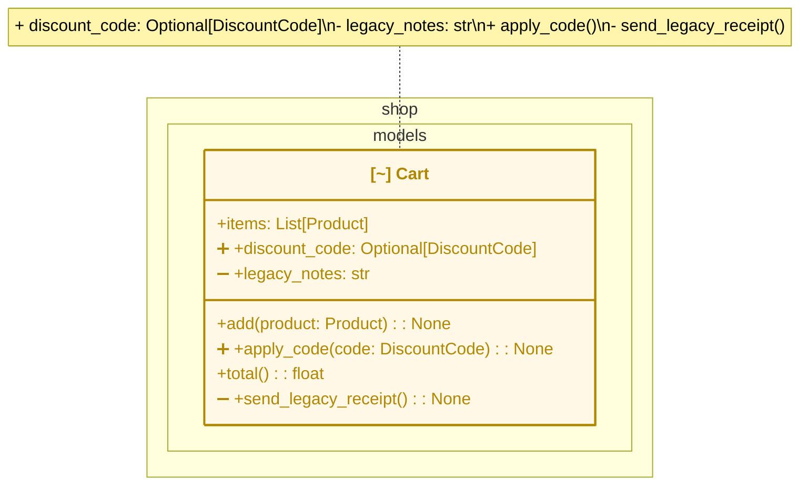
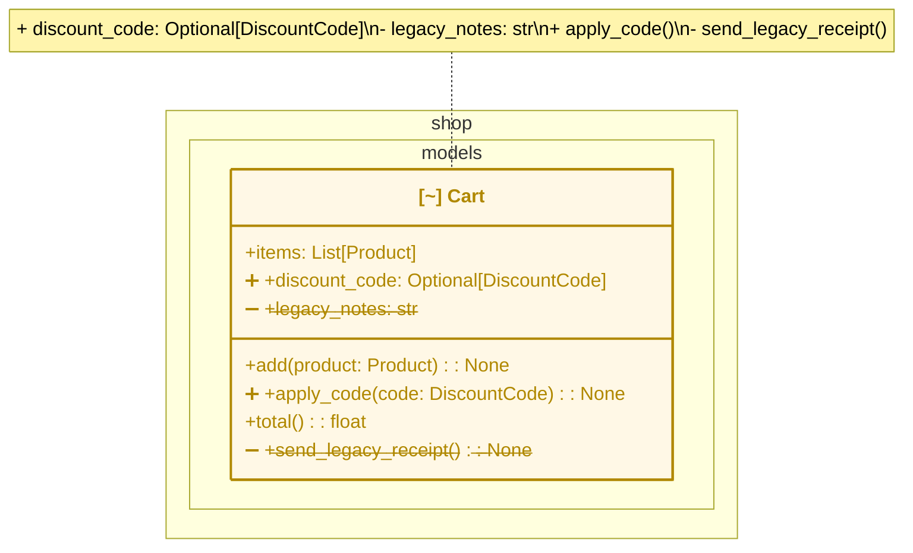

# スパイク: メンバー単位の絵文字マーカー(HQ #36 差し戻し対応)

検証専用の一時ファイル。GitHub実レンダリングでの見た目を確認したら削除する
(architecture.md §7の「v4」節と同じ運用)。

## A: 絵文字マーカーのみ(採用候補)

```mermaid
classDiagram
    namespace shop.models {
        class shop_models_Cart["[~] Cart"] {
            +items: List[Product]
            ➕ +discount_code: Optional[DiscountCode]
            ➖ +legacy_notes: str
            +add(product: Product): None
            ➕ +apply_code(code: DiscountCode): None
            +total(): float
            ➖ +send_legacy_receipt(): None
        }
    }
    style shop_models_Cart fill:#fff8e6,stroke:#b08800,stroke-width:2px,color:#b08800
    note for shop_models_Cart "+ discount_code: Optional[DiscountCode]\n- legacy_notes: str\n+ apply_code()\n- send_legacy_receipt()"
```

## B: 絵文字 + 削除行にUnicode取り消し線合成(U+0336)を追加

```mermaid
classDiagram
    namespace shop.models {
        class shop_models_Cart["[~] Cart"] {
            +items: List[Product]
            ➕ +discount_code: Optional[DiscountCode]
            ➖ +̶l̶e̶g̶a̶c̶y̶_̶n̶o̶t̶e̶s̶:̶ ̶s̶t̶r̶
            +add(product: Product): None
            ➕ +apply_code(code: DiscountCode): None
            +total(): float
            ➖ +̶s̶e̶n̶d̶_̶l̶e̶g̶a̶c̶y̶_̶r̶e̶c̶e̶i̶p̶t̶(̶)̶:̶ ̶N̶o̶n̶e̶
        }
    }
    style shop_models_Cart fill:#fff8e6,stroke:#b08800,stroke-width:2px,color:#b08800
    note for shop_models_Cart "+ discount_code: Optional[DiscountCode]\n- legacy_notes: str\n+ apply_code()\n- send_legacy_receipt()"
```
