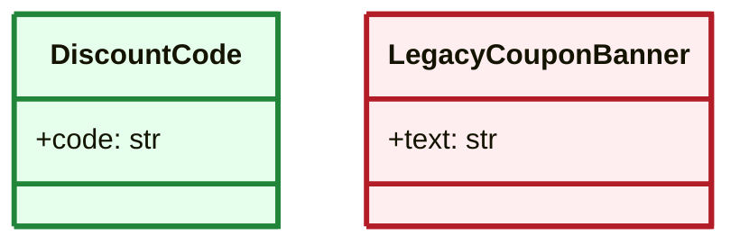

# Mermaid `style`文の検証(GitHub実機テスト用、後で削除)

```mermaid
classDiagram
    class DiscountCode {
        +code: str
    }
    class LegacyCouponBanner {
        +text: str
    }
    style DiscountCode fill:#e6ffed,stroke:#22863a,stroke-width:3px
    style LegacyCouponBanner fill:#ffeef0,stroke:#b31d28,stroke-width:3px
```
