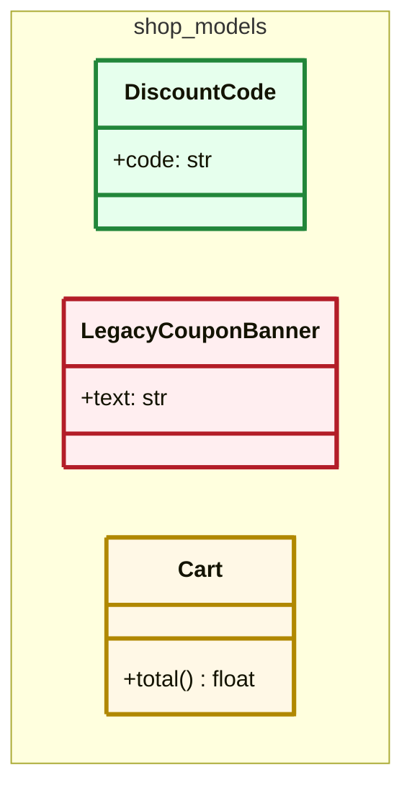

# Mermaid `style`文の検証(GitHub実機テスト用、後で削除)

## namespace + style + label + methods の組み合わせ

```mermaid
classDiagram
    namespace shop_models {
        class shop_models_DiscountCode["DiscountCode"] {
            +code: str
        }
        class shop_models_LegacyCouponBanner["LegacyCouponBanner"] {
            +text: str
        }
        class shop_models_Cart["Cart"] {
            +total() float
        }
    }
    style shop_models_DiscountCode fill:#e6ffed,stroke:#22863a,stroke-width:3px
    style shop_models_LegacyCouponBanner fill:#ffeef0,stroke:#b31d28,stroke-width:3px
    style shop_models_Cart fill:#fff8e6,stroke:#b08800,stroke-width:3px
```
