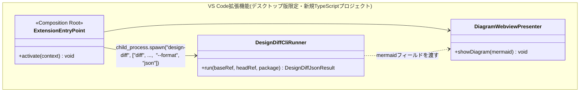

# VS Code拡張機能の実現可能性調査(調査のみ、実装はしない)

**依頼**: 「作業ツリーとHEADの設計差分をエディタ内で見る」VS Code拡張を design-diff
に付ける構想について、`~/herd/plantuml-web`(兄弟プロジェクト)がVS Code Web
Extensionの作法(CSP・WASM・Webview側レンダリング・.vsix配布)を踏破した知見を
読んだ上で、実現可能性を評価する。**本ドキュメントは調査結果の記録であり、
実装には着手していない。**

## 結論(先に)

- **デスクトップ版VS Code拡張として実現するのは、既存資産を100%再利用できる、
  現実的で価値のある企画**。design-diffの既存CLI(`design-diff diff ... --format
  json`)をサブプロセスとして呼び出し、結果のMermaidをWebviewで描画するだけの
  薄いラッパーで済む。ドメイン層・application層・既存アダプタは一切変更不要
- **Web版VS Code(vscode.dev/github.dev)対応は、現状のdesign-diffのアーキテクチャ
  (対象コードを実際にimportして解析する。git worktreeでのサブプロセス実行)
  とは根本的に相性が悪く、実現できない**。plantuml-webがWeb Extension化に
  成功した理由(レンダリングがJS/WASM/DOMだけで完結する)が、design-diffの
  「本質的に難しい部分」(構造抽出)には当てはまらないため
- 唯一、現状のCLIに無い機能として「作業ツリー(コミットされていない変更)を
  一方の入力にする」ための小さな拡張が必要。これは`git worktree add`を経由せず
  作業ディレクトリを直接指せばよいだけで、影響範囲は小さい

## 1. plantuml-webの知見の要約

参照元: `~/herd/plantuml-web/docs/design/architecture.md`,
`step2-vscode-extension-design.md`, `vsix-install-verification.md`,
`known-gaps-verification.md`

- plantuml-webは**VS Code拡張機能(Web版+デスクトップ版の両対応)**という
  配布ターゲットに絞り込んでいる。単体Chrome拡張機能は「Web Extensionは
  子プロセスを起動できないため既存の支配的拡張が原理的に移植できない」という
  勝ち筋と無関係と判断し、司令塔判断でスコープ外にした
- レイヤー構成は design-diff と同じ思想(domain → application →
  infrastructure → Composition Root)。ただし言語はTypeScript
- **最重要の実機検証結果**: レンダリング(`@plantuml/core`のWASM実行)は、
  拡張ホスト(Web Worker。`window`が存在しない)では動かず、**実DOMを持つ
  Webview側で実行する**設計に変更した。拡張ホストはWebviewに`postMessage`で
  ソースを送り、Webview内の別バンドル(`webview-runtime.js`)がWASMを実行して
  結果を返す、というメッセージ往復方式
- Webview側のCSPには`script-src 'wasm-unsafe-eval'`が必要で、これで実際に
  WASM実行が成功することを実機確認済み
- `.vsix`パッケージング後、圧縮サイズ1.94MB。デスクトップ版・クリーンルーム
  環境(他の拡張機能ゼロ、依存先リポジトリと無関係な場所に新規作成した
  `.puml`)の両方で実インストール・動作を確認済み
- 既知の制約(ローカル`!include`不可、スプライトライブラリ非同梱)は、
  ハングせず赤字エラーがSVGとして返ることを実機確認済み(サイレント故障はない)

**この知見が成立する根本理由**: plantuml-webの「難しい部分」(PlantUMLソースを
SVGにレンダリングすること)が、**外部プロセス・ネットワーク・ファイルシステムを
一切必要とせず、JS/WASM/DOMだけで完結する**という性質を持っていたこと。
これがVS Code Web Extension(子プロセス起動不可、仮想ファイルシステムのみ)の
制約と本質的に相性が良かった理由。

## 2. design-diffの「難しい部分」はレンダリングではなく抽出である

design-diffのMermaidレンダリング自体はテキスト生成(`MermaidRenderer`)であり、
plantuml-webのレンダリングと同様にJS/DOMだけで完結する部分は問題にならない
(むしろMermaid自体はGitHubやVS Code組み込みのMarkdownプレビュー拡張が
既にネイティブにレンダリングできる)。

**design-diffの「難しい部分」はクラス構造の抽出そのもの**であり、これは
以下を要求する(README「制約・セキュリティ」参照):

- **対象コードを実際にimportして実行する**(`typing.get_type_hints()`ベースの
  自前実装+py2pumlのクラス発見。実戦テストで検証済みの通り、対象パッケージ
  自身の実行時依存関係も必要)
- **git worktreeのサブプロセス実行**(`git worktree add`。base/head 2つの
  refをそれぞれ別プロセスでチェックアウト・解析する。architecture.md §5.3)
- **Pythonインタプリタそのもの**(`sys.executable`でワーカーを別プロセス
  起動する設計。architecture.md §5.3)

これらはいずれも「子プロセスを起動できない・仮想ファイルシステムのみ・
真のDOMを持たないWeb Worker」というVS Code Web Extensionの実行モデルの
制約に真っ向から抵触する。plantuml-webがWebview側実行という抜け道を
見つけられたのは、その「難しい部分」がJS/WASM/DOM単体で完結する性質
だったからであり、design-diffの「難しい部分」(Pythonコードの実行・git
サブプロセス)には同じ抜け道が存在しない。

## 3. デスクトップ版限定であれば、既存資産の再利用でほぼ実現できる

デスクトップ版VS Code拡張の拡張ホストは通常のNode.jsプロセスであり、子プロセス
起動([`child_process.spawn`](https://nodejs.org/api/child_process.html))が
可能。design-diffの既存CLIは既にこの実行モデルにぴったり合っている
(公式Python拡張機能が対象プロジェクトのPythonインタプリタをサブプロセスとして
呼び出すのと同じパターン)。

想定する最小構成:



- design-diff自身のPythonコード(domain/application/adapters/cli)は
  **一切変更不要**。既存の`design-diff diff <base> <head> --package <pkg>
  --format json`をそのまま呼ぶだけ(JSON出力に`mermaid`フィールドが既に
  同梱されている。architecture.md §6)
- Mermaidの描画は、Webview内(実DOM)でplantuml-webと同じ手法(別バンドルとして
  Mermaid本体を読み込み、`postMessage`往復、または単純にWebviewの`html`に
  ```mermaid フェンス付きMarkdownを埋め込みVS Code組み込みのMermaidレンダラーに
  委ねる方法もある)で行える。WASM不要(Mermaid.jsは純粋なJS+DOM)なので
  plantuml-webより単純
- 新規に書く必要があるのはTypeScriptの薄いラッパー(Composition Root +
  サブプロセス起動 + Webview表示)のみ

### 唯一の機能ギャップ: 「作業ツリー」を一方の入力にできない

現状のCLIの`design-diff diff <base_ref> <head_ref>`は、**両方とも実際の
gitのref(ブランチ・タグ・コミット)である必要がある**。`GitWorktreeVcs.checkout()`
は内部で`git worktree add --detach <target> <ref>`を実行しており
(`src/design_diff/adapters/vcs/git_worktree.py:31-44`)、これは**コミットされて
いない変更(作業ツリーの現状)を表現できない**(gitのrefはコミット済みの
スナップショットのみを指せるため)。

つまり「作業ツリーとHEADの設計差分」という依頼文言そのものを実現するには、
CLI/VcsPortに小さな機能追加が要る。ただし影響範囲は小さいと判断する:

- 作業ツリー側は`git worktree add`によるチェックアウトが不要(既にディスク上に
  実体があるため)。`VcsPort.checkout()`に「作業ツリーそのものを指す特別な
  ref」(例: 空文字列や`"WORKTREE"`という予約語)を渡した場合はチェックアウトを
  スキップしてリポジトリルートのパスをそのまま返す、という分岐を
  `GitWorktreeVcs`に追加するだけで済みそうに見える(要設計レビュー)
- HEAD側は既存の仕組み(`git worktree add`によるチェックアウト)がそのまま使える
- ドメイン層・application層への影響は無い(`ExtractorPort.extract(path, ...)`は
  すでにパスを受け取るだけで、そのパスがgit worktreeか作業ツリーそのものかを
  意識しない)

## 4. 推奨(次にやるなら、という位置づけ。今回は着手しない)

1. 上記の「作業ツリー」対応をCLIに追加する設計を先に固める(小さいが、
   `docs/design/`での設計レビューを経てから実装すべき変更)
2. VS Code拡張機能は design-diff とは別のリポジトリ(plantuml-webと同じ形)、
   別言語(TypeScript)のプロジェクトとして立てる。design-diffの既存CLIを
   サブプロセスとして呼ぶだけの薄いラッパーに徹し、抽出ロジックを拡張機能側に
   持ち込まない
3. 配布ターゲットは**デスクトップ版限定**と割り切る。「PRを出す前にエディタ内で
   設計差分を見る」という価値提案は、ローカルで開発中の未コミット変更を見る
   ユースケースであり、これは開発者が実際にコードを書いている環境
   (=ほぼ確実にデスクトップ版VS Code)と一致する。「既にpushされたPRを
   ブラウザで俯瞰する」ユースケースは、既存のGitHub Action(PRコメント自動投稿)
   が既にカバーしており、Web版VS Code対応が無くても価値提案の欠落にはならない

## 5. 調査時点のステータス

- 調査のみ実施。design-diff・plantuml-webいずれのコードにも変更を加えていない
- 実装着手には至っていない。上記「推奨」を検討する場合は、着手前に
  `docs/design/`へ正式な設計ドキュメントを書き、レビューを経ること
  (CLAUDE.md「設計ファースト」方針)
