# 出力例: design-diff自身の設計diff(ドッグフーディング)

`design-diff diff 96015aa e120a4a --package design_diff --format mermaid` の実際の出力
(手を加えていない)。設計完了直後の時点から、実装フェーズ
(TDDでのドメイン/application/adapters/CLI実装、表示品質改善)完了時点までの差分。

36クラスが変更され、サイズ上限(既定20)を超えたため、影響度(差分の大きさ)順に
上位20件のみを図示し、`note` で省略件数を明示している(図のサイズ制御機能)。
完全な一覧は `--format json` で得られる。

状態は`[+]`(追加)のASCIIタグで示し、可視性マーカー(`+`/`-`)でプライベートメンバー
(アンダースコア始まり)を見分けられる。型注釈の無い属性(`payload`など)は型部分を
省略して表示する。

```mermaid
classDiagram
    namespace design_diff.action.main {
        class design_diff_action_main_ActionConfig["[+] ActionConfig"] {
            +base_ref: str
            +head_ref: str
            +package: str
            +pr: int
            +repo: str
            +repo_path: Path | None
            +include_dunder: bool
        }
    }
    namespace design_diff.adapters.github.comment_poster {
        class design_diff_adapters_github_comment_poster_GitHubCommentPoster["[+] GitHubCommentPoster"] {
            -_repo: str
            -_run: Callable[[list[str]], object]
            -_call(args: list[str])
            -_find_existing_comment_id(pr: int): int | None
            -_patch(comment_id: int, body: str): None
            -_post(pr: int, body: str): None
            +upsert(pr: int, body: str): None
        }
    }
    namespace design_diff.adapters.rendering.mermaid_renderer {
        class design_diff_adapters_rendering_mermaid_renderer_MermaidRenderer["[+] MermaidRenderer"] {
            -_max_classes: int
            -_collect_changed_classes(diff: SnapshotDiff): list[_ChangedClass]
            -_collect_notes(selected: list[_ChangedClass]): list[str]
            -_declaration_for(entry: _ChangedClass): _ClassDeclaration
            -_render_namespaced_declarations(declarations: dict[str, _ClassDeclaration]): list[str]
            -_render_relation_line(relation: RelationIR, removed: bool): str
            -_select_top_n(changed: list[_ChangedClass]): list[_ChangedClass]
            -_summary_note(total: int, shown: int): str
            +render(diff: SnapshotDiff, mermaid: str | None, meta: dict[str, str] | None): str
        }
        class design_diff_adapters_rendering_mermaid_renderer__ChangedClass["[+] _ChangedClass"] {
            +fqn: str
            +impact: int
            +kind: str
            +payload
        }
        class design_diff_adapters_rendering_mermaid_renderer__ClassDeclaration["[+] _ClassDeclaration"] {
            +fqn: str
            +node_id
            +namespace
            +label
            +style: str | None
            +body_lines: list[str]
            +render(): list[str]
        }
    }
    namespace design_diff.adapters.vcs.git_worktree {
        class design_diff_adapters_vcs_git_worktree_GitWorktreeVcs["[+] GitWorktreeVcs"] {
            -_repo_path
            -_worktree_root
            +checkout(ref: str): Path
            +cleanup(path: Path): None
        }
    }
    namespace design_diff.application.ports {
        class design_diff_application_ports_CommentPort["CommentPort"]
        class design_diff_application_ports_ExtractorPort["ExtractorPort"]
        class design_diff_application_ports_RendererPort["RendererPort"]
        class design_diff_application_ports_VcsPort["VcsPort"]
    }
    namespace design_diff.application.use_cases.compute_design_diff {
        class design_diff_application_use_cases_compute_design_diff_ComputeDesignDiffUseCase["[+] ComputeDesignDiffUseCase"] {
            -_vcs: VcsPort
            -_extractor: ExtractorPort
            -_mermaid_renderer: RendererPort
            -_json_renderer: RendererPort
            -_diff_engine
            +execute(base_ref: str, head_ref: str, package: str, include_dunder: bool): DesignDiffResult
        }
        class design_diff_application_use_cases_compute_design_diff_DesignDiffResult["[+] DesignDiffResult"] {
            +diff: SnapshotDiff
            +mermaid: str
            +json_payload: str
        }
    }
    namespace design_diff.application.use_cases.post_design_diff_comment {
        class design_diff_application_use_cases_post_design_diff_comment_PostDesignDiffCommentUseCase["[+] PostDesignDiffCommentUseCase"] {
            -_compute_use_case: ComputeDesignDiffUseCase | _ComputeUseCase
            -_comment_port: CommentPort
            +execute(pr: int, base_ref: str, head_ref: str, package: str, include_dunder: bool): DesignDiffResult
        }
        class design_diff_application_use_cases_post_design_diff_comment__ComputeUseCase["_ComputeUseCase"]
    }
    namespace design_diff.domain.diff {
        class design_diff_domain_diff_AttributeChange["[+] AttributeChange"] {
            +name: str
            +old_type: str
            +new_type: str
            +old_static: bool
            +new_static: bool
        }
        class design_diff_domain_diff_AttributeDiff["[+] AttributeDiff"] {
            +added: tuple[AttributeIR, ...]
            +removed: tuple[AttributeIR, ...]
            +changed: tuple[AttributeChange, ...]
        }
        class design_diff_domain_diff_ClassDiff["[+] ClassDiff"] {
            +added: tuple[ClassIR, ...]
            +removed: tuple[ClassIR, ...]
            +modified: tuple[ClassModification, ...]
        }
        class design_diff_domain_diff_ClassModification["[+] ClassModification"] {
            +fqn: str
            +name: str
            +attributes: AttributeDiff
            +methods: MethodDiff
            +base_class: ClassIR
            +head_class: ClassIR
            +is_abstract_changed: bool
        }
        class design_diff_domain_diff_DiffEngine["[+] DiffEngine"] {
            -_diff_attributes(base_attrs: tuple[AttributeIR, ...], head_attrs: tuple[AttributeIR, ...]): AttributeDiff
            -_diff_classes(base: Mapping[str, ClassIR], head: Mapping[str, ClassIR]): ClassDiff
            -_diff_methods(base_methods: tuple[MethodIR, ...], head_methods: tuple[MethodIR, ...]): MethodDiff
            -_diff_relations(base_relations: frozenset[RelationIR], head_relations: frozenset[RelationIR]): RelationDiff
            +diff(base: SnapshotIR, head: SnapshotIR): SnapshotDiff
        }
        class design_diff_domain_diff_MethodChange["[+] MethodChange"] {
            +name: str
            +old: MethodIR
            +new: MethodIR
        }
        class design_diff_domain_diff_MethodDiff["[+] MethodDiff"] {
            +added: tuple[MethodIR, ...]
            +removed: tuple[MethodIR, ...]
            +changed: tuple[MethodChange, ...]
        }
        class design_diff_domain_diff_RelationDiff["RelationDiff"]
        class design_diff_domain_diff_SnapshotDiff["SnapshotDiff"]
    }
    namespace design_diff.domain.model {
        class design_diff_domain_model_AttributeIR["[+] AttributeIR"] {
            +name: str
            +type: str
            +static: bool
        }
        class design_diff_domain_model_ClassIR["[+] ClassIR"] {
            +fqn: str
            +name: str
            +is_abstract: bool
            +attributes: tuple[AttributeIR, ...]
            +methods: tuple[MethodIR, ...]
        }
        class design_diff_domain_model_MethodIR["[+] MethodIR"] {
            +name: str
            +parameters: tuple[ParameterIR, ...]
            +return_type: str | None
        }
        class design_diff_domain_model_ParameterIR["ParameterIR"]
        class design_diff_domain_model_RelationIR["[+] RelationIR"] {
            +source_fqn: str
            +target_fqn: str
            +type: RelationType
        }
        class design_diff_domain_model_RelationType["RelationType"]
        class design_diff_domain_model_SnapshotIR["SnapshotIR"]
    }
    note "36 classes changed - showing top 20 by impact.\nSee the JSON output for the complete list."
    design_diff_application_use_cases_compute_design_diff_ComputeDesignDiffUseCase *-- design_diff_application_ports_ExtractorPort
    design_diff_application_use_cases_compute_design_diff_ComputeDesignDiffUseCase *-- design_diff_application_ports_RendererPort
    design_diff_application_use_cases_compute_design_diff_ComputeDesignDiffUseCase *-- design_diff_application_ports_VcsPort
    design_diff_application_use_cases_compute_design_diff_DesignDiffResult *-- design_diff_domain_diff_SnapshotDiff
    design_diff_application_use_cases_post_design_diff_comment_PostDesignDiffCommentUseCase *-- design_diff_application_ports_CommentPort
    design_diff_application_use_cases_post_design_diff_comment_PostDesignDiffCommentUseCase *-- design_diff_application_use_cases_compute_design_diff_ComputeDesignDiffUseCase
    design_diff_application_use_cases_post_design_diff_comment_PostDesignDiffCommentUseCase *-- design_diff_application_use_cases_post_design_diff_comment__ComputeUseCase
    design_diff_domain_diff_AttributeDiff *-- design_diff_domain_diff_AttributeChange
    design_diff_domain_diff_AttributeDiff *-- design_diff_domain_model_AttributeIR
    design_diff_domain_diff_ClassDiff *-- design_diff_domain_diff_ClassModification
    design_diff_domain_diff_ClassDiff *-- design_diff_domain_model_ClassIR
    design_diff_domain_diff_ClassModification *-- design_diff_domain_diff_AttributeDiff
    design_diff_domain_diff_ClassModification *-- design_diff_domain_diff_MethodDiff
    design_diff_domain_diff_ClassModification *-- design_diff_domain_model_ClassIR
    design_diff_domain_diff_MethodChange *-- design_diff_domain_model_MethodIR
    design_diff_domain_diff_MethodDiff *-- design_diff_domain_diff_MethodChange
    design_diff_domain_diff_MethodDiff *-- design_diff_domain_model_MethodIR
    design_diff_domain_diff_RelationDiff *-- design_diff_domain_model_RelationIR
    design_diff_domain_diff_SnapshotDiff *-- design_diff_domain_diff_ClassDiff
    design_diff_domain_diff_SnapshotDiff *-- design_diff_domain_diff_RelationDiff
    design_diff_domain_model_ClassIR *-- design_diff_domain_model_AttributeIR
    design_diff_domain_model_ClassIR *-- design_diff_domain_model_MethodIR
    design_diff_domain_model_MethodIR *-- design_diff_domain_model_ParameterIR
    design_diff_domain_model_RelationIR *-- design_diff_domain_model_RelationType
    design_diff_domain_model_SnapshotIR *-- design_diff_domain_model_ClassIR
    design_diff_domain_model_SnapshotIR *-- design_diff_domain_model_RelationIR
```

## 読み取れること

- `design_diff.adapters.*` / `application.*` / `domain.*` という namespace 単位で
  クラスがグループ化され、「どのレイヤーに何が生えたか」が一目で分かる
- `ComputeDesignDiffUseCase *-- ExtractorPort/RendererPort/VcsPort` という
  コンポジション依存が、architecture.md の設計通りに実際のコードから抽出されている
- プライベートメンバー(`_`始まり)は`-`、公開メンバーは`+`で区別され、
  クラスの公開APIが一目で分かる
