# 出力例: design-diff自身の設計diff(ドッグフーディング)

`design-diff diff 96015aa 567b5a3 --package design_diff --format mermaid` の実際の出力
(手を加えていない)。設計フェーズ完了時点(HQレビュー合格直後)から、実装フェーズ
(TDDでのドメイン/application/adapters/CLI実装、表示品質改善)完了時点までの差分。

31クラスが変更され、サイズ上限(既定20)を超えたため、影響度(差分の大きさ)順に
上位20件のみを図示し、`note` で省略件数を明示している(HQ追加要件: 図のサイズ制御)。
完全な一覧は `--format json` で得られる。

```mermaid
classDiagram
    classDef added fill:#e6ffed,stroke:#22863a,color:#22863a
    classDef removed fill:#ffeef0,stroke:#b31d28,color:#b31d28
    classDef modified fill:#fff8e6,stroke:#b08800,color:#7a5c00

    namespace design_diff.adapters.extraction.py2puml_extractor {
        class design_diff_adapters_extraction_py2puml_extractor_Py2pumlExtractor["Py2pumlExtractor"]:::added {
            +_to_snapshot_ir(payload: dict): SnapshotIR
            +extract(path: Path, package: str, include_dunder: bool): SnapshotIR
        }
    }
    namespace design_diff.adapters.rendering.mermaid_renderer {
        class design_diff_adapters_rendering_mermaid_renderer_MermaidRenderer["MermaidRenderer"]:::added {
            +_max_classes: int
            +_collect_changed_classes(diff: SnapshotDiff): list[_ChangedClass]
            +_collect_notes(selected: list[_ChangedClass]): list[str]
            +_declaration_for(entry: _ChangedClass): _ClassDeclaration
            +_render_namespaced_declarations(declarations: dict[str, _ClassDeclaration]): list[str]
            +_render_relation_line(relation: RelationIR, removed: bool): str
            +_select_top_n(changed: list[_ChangedClass]): list[_ChangedClass]
            +_summary_note(total: int, shown: int): str
            +render(diff: SnapshotDiff, mermaid: str | None, meta: dict[str, str] | None): str
        }
        class design_diff_adapters_rendering_mermaid_renderer__ChangedClass["_ChangedClass"]:::added {
            +fqn: str
            +impact: int
            +kind: str
            +payload: None
        }
        class design_diff_adapters_rendering_mermaid_renderer__ClassDeclaration["_ClassDeclaration"]:::added {
            +fqn: str
            +node_id: None
            +namespace: None
            +label: None
            +style: str | None
            +body_lines: list[str]
            +render(): list[str]
        }
    }
    namespace design_diff.adapters.vcs.git_worktree {
        class design_diff_adapters_vcs_git_worktree_GitWorktreeVcs["GitWorktreeVcs"]:::added {
            +_repo_path: None
            +_worktree_root: None
            +checkout(ref: str): Path
            +cleanup(path: Path): None
        }
    }
    namespace design_diff.application.ports {
        class design_diff_application_ports_ExtractorPort["ExtractorPort"]
        class design_diff_application_ports_RendererPort["RendererPort"]
        class design_diff_application_ports_VcsPort["VcsPort"]:::added {
            +checkout(ref: str): Path
            +cleanup(path: Path): None
        }
    }
    namespace design_diff.application.use_cases.compute_design_diff {
        class design_diff_application_use_cases_compute_design_diff_ComputeDesignDiffUseCase["ComputeDesignDiffUseCase"]:::added {
            +_vcs: VcsPort
            +_extractor: ExtractorPort
            +_mermaid_renderer: RendererPort
            +_json_renderer: RendererPort
            +_diff_engine: None
            +execute(base_ref: str, head_ref: str, package: str, include_dunder: bool): DesignDiffResult
        }
        class design_diff_application_use_cases_compute_design_diff_DesignDiffResult["DesignDiffResult"]:::added {
            +diff: SnapshotDiff
            +mermaid: str
            +json_payload: str
        }
    }
    namespace design_diff.domain.diff {
        class design_diff_domain_diff_AttributeChange["AttributeChange"]:::added {
            +name: str
            +old_type: str
            +new_type: str
            +old_static: bool
            +new_static: bool
        }
        class design_diff_domain_diff_AttributeDiff["AttributeDiff"]:::added {
            +added: tuple[AttributeIR, ...]
            +removed: tuple[AttributeIR, ...]
            +changed: tuple[AttributeChange, ...]
        }
        class design_diff_domain_diff_ClassDiff["ClassDiff"]:::added {
            +added: tuple[ClassIR, ...]
            +removed: tuple[ClassIR, ...]
            +modified: tuple[ClassModification, ...]
        }
        class design_diff_domain_diff_ClassModification["ClassModification"]:::added {
            +fqn: str
            +name: str
            +attributes: AttributeDiff
            +methods: MethodDiff
            +base_class: ClassIR
            +head_class: ClassIR
            +is_abstract_changed: bool
        }
        class design_diff_domain_diff_DiffEngine["DiffEngine"]:::added {
            +_diff_attributes(base_attrs: tuple[AttributeIR, ...], head_attrs: tuple[AttributeIR, ...]): AttributeDiff
            +_diff_classes(base: Mapping[str, ClassIR], head: Mapping[str, ClassIR]): ClassDiff
            +_diff_methods(base_methods: tuple[MethodIR, ...], head_methods: tuple[MethodIR, ...]): MethodDiff
            +_diff_relations(base_relations: frozenset[RelationIR], head_relations: frozenset[RelationIR]): RelationDiff
            +diff(base: SnapshotIR, head: SnapshotIR): SnapshotDiff
        }
        class design_diff_domain_diff_MethodChange["MethodChange"]:::added {
            +name: str
            +old: MethodIR
            +new: MethodIR
        }
        class design_diff_domain_diff_MethodDiff["MethodDiff"]:::added {
            +added: tuple[MethodIR, ...]
            +removed: tuple[MethodIR, ...]
            +changed: tuple[MethodChange, ...]
        }
        class design_diff_domain_diff_RelationDiff["RelationDiff"]
        class design_diff_domain_diff_SnapshotDiff["SnapshotDiff"]
    }
    namespace design_diff.domain.model {
        class design_diff_domain_model_AttributeIR["AttributeIR"]:::added {
            +name: str
            +type: str
            +static: bool
        }
        class design_diff_domain_model_ClassIR["ClassIR"]:::added {
            +fqn: str
            +name: str
            +is_abstract: bool
            +attributes: tuple[AttributeIR, ...]
            +methods: tuple[MethodIR, ...]
        }
        class design_diff_domain_model_MethodIR["MethodIR"]:::added {
            +name: str
            +parameters: tuple[ParameterIR, ...]
            +return_type: str | None
        }
        class design_diff_domain_model_ParameterIR["ParameterIR"]
        class design_diff_domain_model_RelationIR["RelationIR"]:::added {
            +source_fqn: str
            +target_fqn: str
            +type: RelationType
        }
        class design_diff_domain_model_RelationType["RelationType"]
        class design_diff_domain_model_SnapshotIR["SnapshotIR"]:::added {
            +package: str
            +classes: dict[str, ClassIR]
            +relations: frozenset[RelationIR]
        }
    }
    note "31 classes changed - showing top 20 by impact.\nSee the JSON output for the complete list."
    design_diff_application_use_cases_compute_design_diff_ComputeDesignDiffUseCase *-- design_diff_application_ports_ExtractorPort
    design_diff_application_use_cases_compute_design_diff_ComputeDesignDiffUseCase *-- design_diff_application_ports_RendererPort
    design_diff_application_use_cases_compute_design_diff_ComputeDesignDiffUseCase *-- design_diff_application_ports_VcsPort
    design_diff_application_use_cases_compute_design_diff_DesignDiffResult *-- design_diff_domain_diff_SnapshotDiff
    design_diff_domain_diff_AttributeDiff *-- design_diff_domain_diff_AttributeChange
    design_diff_domain_diff_AttributeDiff *-- design_diff_domain_model_AttributeIR
    design_diff_domain_diff_ClassDiff *-- design_diff_domain_diff_ClassModification
    design_diff_domain_diff_ClassDiff *-- design_diff_domain_model_ClassIR
    design_diff_domain_diff_ClassModification *-- design_diff_domain_diff_AttributeDiff
    design_diff_domain_diff_ClassModification *-- design_diff_domain_diff_MethodDiff
    design_diff_domain_diff_ClassModification *-- design_diff_domain_model_ClassIR
    design_diff_domain_diff_MethodChange *-- design_diff_domain_model_MethodIR
    design_diff_domain_diff_MethodDiff *-- design_diff_domain_diff_MethodChange
    design_diff_domain_diff_MethodDiff *-- design_diff_domain_model_MethodIR
    design_diff_domain_diff_RelationDiff *-- design_diff_domain_model_RelationIR
    design_diff_domain_diff_SnapshotDiff *-- design_diff_domain_diff_ClassDiff
    design_diff_domain_diff_SnapshotDiff *-- design_diff_domain_diff_RelationDiff
    design_diff_domain_model_ClassIR *-- design_diff_domain_model_AttributeIR
    design_diff_domain_model_ClassIR *-- design_diff_domain_model_MethodIR
    design_diff_domain_model_MethodIR *-- design_diff_domain_model_ParameterIR
    design_diff_domain_model_RelationIR *-- design_diff_domain_model_RelationType
    design_diff_domain_model_SnapshotIR *-- design_diff_domain_model_ClassIR
    design_diff_domain_model_SnapshotIR *-- design_diff_domain_model_RelationIR
```

## 読み取れること

- `design_diff.adapters.*` / `application.*` / `domain.*` という namespace 単位で
  クラスがグループ化され、「どのレイヤーに何が生えたか」が一目で分かる
- `ComputeDesignDiffUseCase *-- ExtractorPort/RendererPort/VcsPort` という
  コンポジション依存が、architecture.md の設計通りに実際のコードから抽出されている
- 既知の残課題(次イテレーション候補、あえて今回のスコープには含めていない):
  プライベートメンバー(`_`始まり)の表示ノイズ、型アノテーションの無い属性が
  `None` 型として表示される点。いずれもpy2pumlの解析限界とREADMEの制約セクションに
  対応する
