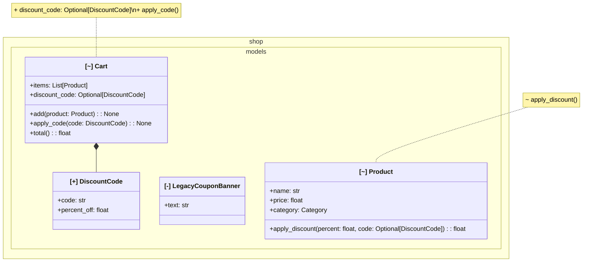

# 出力例: `shop` パッケージへの機能追加

小さなオンラインショップのモデル層に「割引コード」機能を追加したケース。
`design-diff diff main feature/discount-codes --package shop --format mermaid`
の実際の出力(手を加えていない)。

- `DiscountCode` クラスが追加された(`[+]`)
- `LegacyCouponBanner` クラスが削除された(`[-]`)
- `Cart` / `Product` が変更された(`[~]`) — 何が増減したかは `note` に要約される
- `Cart *-- DiscountCode` というコンポジション依存が新たに生えた

状態はラベルのASCIIタグ(`[+]`/`[-]`/`[~]`)で示す。当初はMermaidの`classDef`/
`cssClass`による色分けを検討したが、GitHub・mermaid.live双方の実機検証で
classDiagramのスタイリングが全く反映されないことを確認した(design-diff固有では
なくupstream Mermaidの既知の問題。[mermaid-js/mermaid#1649](https://github.com/mermaid-js/mermaid/issues/1649))。
絵文字での代替も検討したが、環境によって絵文字グリフを持たない場合がありグローバルな
利用を想定すると前提にできないため、環境非依存で確実に描画されるASCII記号を採用した
(JSON出力やnote内の差分表記と同じ`+`/`-`/`~`に統一)。

このMermaidブロックはGitHubのコメント/README上でそのままプレビューされる。



## 対応するJSON出力(抜粋)

AIレビュアーやCI連携が読む機械可読フォーマット。`summary` を見るだけで
規模感(追加1・削除1・変更2・依存追加1)が分かる。完全な出力は
`design-diff diff ... --format json` で得られるオブジェクト全体(`classes`配下に
属性・メソッドの完全な差分、`mermaid`フィールドに上のMermaidブロックも同梱される)。

```json
{
  "schema_version": "1.0",
  "tool": "design-diff",
  "package": "shop",
  "base_ref": "main",
  "head_ref": "feature/discount-codes",
  "has_changes": true,
  "summary": {
    "classes_added": 1,
    "classes_removed": 1,
    "classes_modified": 2,
    "relations_added": 1,
    "relations_removed": 0
  }
}
```
