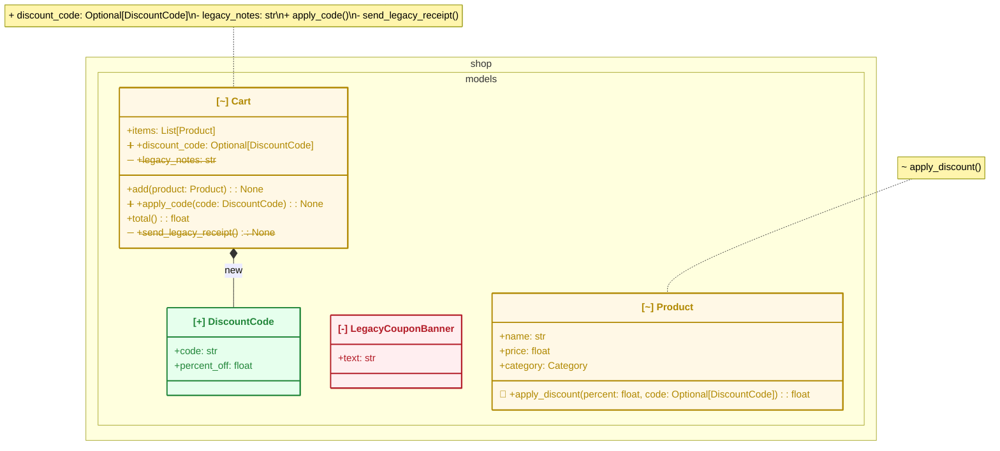

# 出力例: `shop` パッケージへの機能追加

小さなオンラインショップのモデル層に「割引コード」機能を追加したケース。
`design-diff diff main feature/discount-codes --package shop --format mermaid`
の実際の出力(手を加えていない)。

- `DiscountCode` クラスが追加された(`[+]`)
- `LegacyCouponBanner` クラスが削除された(`[-]`)
- `Cart` / `Product` が変更された(`[~]`) — クラス単位の要約は `note` に出るが、
  **どのproperty/methodが増減したかはクラス本体の中のメンバー行自体に直接示す**
  (`Cart`は追加プロパティ・追加メソッド・削除プロパティ・削除メソッドの
  4種類全てを含む: `discount_code`/`apply_code()`は行頭に➕、`legacy_notes`/
  `send_legacy_receipt()`は行頭に➖かつ取り消し線。`Product.apply_discount()`は
  シグネチャ変更で行頭に🔀)
- `Cart *-- DiscountCode` というコンポジション依存が新たに生えた(矢印ラベルで`: new`)

状態はラベルのASCIIタグ(クラス単位は`[+]`/`[-]`/`[~]`)と、`style`文による実際の
色分け(追加=緑/削除=赤/変更=黄、クラス単位)の両方で示す。
Mermaidの`classDef`/`cssClass`による色分けは、GitHub・mermaid.live双方の実機検証で
classDiagramのスタイリングが全く反映されないことを確認した(design-diff固有では
なくupstream Mermaidの既知の問題。[mermaid-js/mermaid#1649](https://github.com/mermaid-js/mermaid/issues/1649))。
一方、ノード単体を対象にする`style <id> fill:...,stroke:...,color:...;`文は別の
Mermaid機構であり、GitHub実機(namespace記法併用時含む)で緑/赤/黄の背景・枠線・
文字色が実際に描画されることを確認済み。ただし**Mermaidのclassdiagramはメンバー行
1つ1つにstyle(色)を当てる機構を持たない**(公式ドキュメント・GitHub issueで確認
済み。architecture.md §7参照)ため、クラスのどのメンバーが増減したかは色ではなく
**メンバー行の先頭に付ける絵文字マーカー**(➕追加/➖削除/🔀変更)で表現している。
削除された行にはさらにUnicode取り消し線合成(U+0336)でテキスト自体にも取り消し線を
引く(GitHub実機で崩れずに描画されることを確認済み)。追加/削除されたリレーションの
線にも矢印ラベル記法で`: new`/`: removed`を付ける。

このMermaidブロックはGitHubのコメント/README上でそのままプレビューされる。



## 対応するJSON出力(抜粋)

AIレビュアーやCI連携が読む機械可読フォーマット。`summary` を見るだけで
規模感(追加1・削除1・変更2・依存追加1)が分かる。完全な出力は
`design-diff diff ... --format json` で得られるオブジェクト全体(`classes`配下に
属性・メソッドの完全な差分、`mermaid`フィールドに上のMermaidブロックも同梱される)。

```json
{
  "schema_version": "1.1",
  "tool": "design-diff",
  "package": "shop",
  "base_ref": "main",
  "head_ref": "feature/discount-codes",
  "has_changes": true,
  "warnings": [],
  "summary": {
    "classes_added": 1,
    "classes_removed": 1,
    "classes_modified": 2,
    "relations_added": 1,
    "relations_removed": 0
  }
}
```
