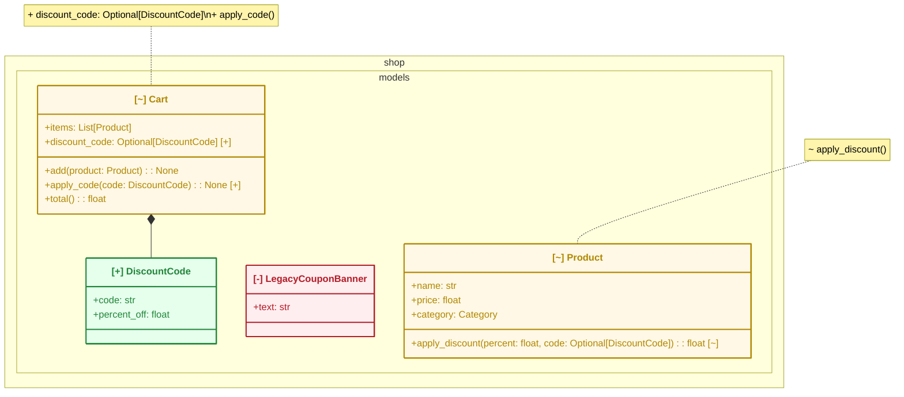

# 出力例: `shop` パッケージへの機能追加

小さなオンラインショップのモデル層に「割引コード」機能を追加したケース。
`design-diff diff main feature/discount-codes --package shop --format mermaid`
の実際の出力(手を加えていない)。

- `DiscountCode` クラスが追加された(`[+]`)
- `LegacyCouponBanner` クラスが削除された(`[-]`)
- `Cart` / `Product` が変更された(`[~]`) — クラス単位の要約は `note` に出るが、
  **どのproperty/methodが増減したかはクラス本体の中のメンバー行自体に直接示す**
  (`discount_code`/`apply_code()` の行末に `[+]`、`apply_discount()` の行末に
  `[~]`。削除された属性/メソッドもheadには存在しないが、本体の中に`[-]`付きで
  表示する)
- `Cart *-- DiscountCode` というコンポジション依存が新たに生えた

状態はラベルのASCIIタグ(クラス単位/メンバー単位とも`[+]`/`[-]`/`[~]`)と、
`style`文による実際の色分け(追加=緑/削除=赤/変更=黄、クラス単位)の両方で示す。
Mermaidの`classDef`/`cssClass`による色分けは、GitHub・mermaid.live双方の実機検証で
classDiagramのスタイリングが全く反映されないことを確認した(design-diff固有では
なくupstream Mermaidの既知の問題。[mermaid-js/mermaid#1649](https://github.com/mermaid-js/mermaid/issues/1649))。
一方、ノード単体を対象にする`style <id> fill:...,stroke:...,color:...;`文は別の
Mermaid機構であり、GitHub実機(namespace記法併用時含む)で緑/赤/黄の背景・枠線・
文字色が実際に描画されることを確認済み。ただし**Mermaidのclassdiagramはメンバー行
1つ1つにstyle(色)を当てる機構を持たない**ため、クラスのどのメンバーが増減したかは
色ではなくメンバー行自体へのASCIIタグで表現している。絵文字での代替も検討したが、
環境によって絵文字グリフを持たない場合がありグローバルな利用を想定すると前提に
できないため不採用。ASCIIタグは色だけに頼らないための冗長化としても機能する
(色覚特性やカラー非対応ビューアでも状態が読み取れるように)。

このMermaidブロックはGitHubのコメント/README上でそのままプレビューされる。



## 対応するJSON出力(抜粋)

AIレビュアーやCI連携が読む機械可読フォーマット。`summary` を見るだけで
規模感(追加1・削除1・変更2・依存追加1)が分かる。完全な出力は
`design-diff diff ... --format json` で得られるオブジェクト全体(`classes`配下に
属性・メソッドの完全な差分、`mermaid`フィールドに上のMermaidブロックも同梱される)。

```json
{
  "schema_version": "1.0",
  "tool": "design-diff",
  "package": "shop",
  "base_ref": "main",
  "head_ref": "feature/discount-codes",
  "has_changes": true,
  "summary": {
    "classes_added": 1,
    "classes_removed": 1,
    "classes_modified": 2,
    "relations_added": 1,
    "relations_removed": 0
  }
}
```
